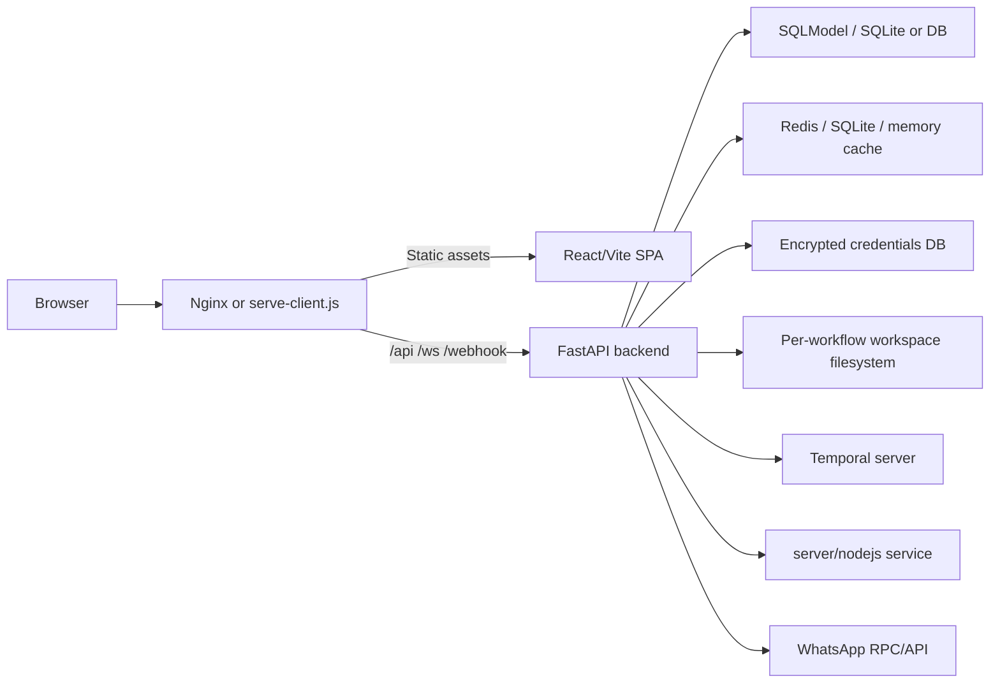
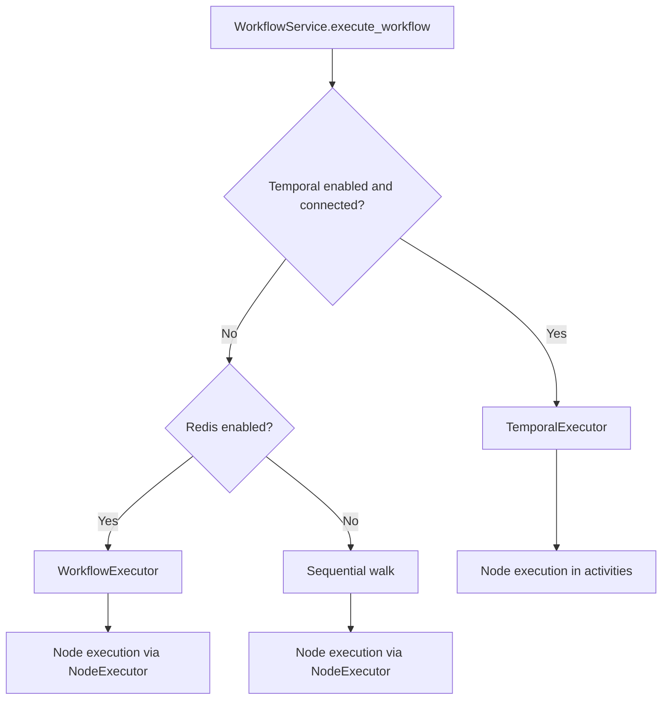

# Current System Architecture Analysis

Last reviewed: 2026-04-12

## Purpose

This document captures the current architecture of the MachinaOs codebase as it exists in this repository today. It focuses on:

- The frontend application and how it is composed
- The backend services that serve and execute workflows
- The current runtime and deployment topology
- The current node and panel extension model
- The architectural limits that matter for a future 1000+ node system

This is a code-audit document, not a target-state RFC. For the researched target architecture, see:

- [production_scale_architecture_research.md](production_scale_architecture_research.md)
- [config_driven_node_platform.md](config_driven_node_platform.md)

---

## Executive Summary

MachinaOs is currently a split-stack workflow platform with a React Flow SPA on the frontend and a FastAPI backend that acts as:

- auth service
- workflow persistence layer
- orchestration layer
- node execution gateway
- realtime event bus
- background service host

The system already contains several production-oriented ideas:

- dependency injection on the backend
- separated execution modes
- optional Temporal integration
- Redis-backed parallel execution
- encrypted credential storage
- a separate Node.js execution surface

However, the platform is still organized around a few high-coupling modules:

- `client/src/Dashboard.tsx`
- `client/src/contexts/WebSocketContext.tsx`
- `server/routers/websocket.py`
- `server/services/node_executor.py`

Those files are carrying too many responsibilities. That is the main reason the current system is workable for a mid-sized node catalog but will become expensive to extend and risky to scale to:

- 1000+ nodes in one graph
- 1000+ supported node types
- high-throughput concurrent executions
- low-memory runtime requirements

---

## Audit Scope

The findings in this document are based on the repository structure and the following core paths:

- `client/src/main.tsx`
- `client/src/App.tsx`
- `client/src/Dashboard.tsx`
- `client/src/contexts/WebSocketContext.tsx`
- `client/src/ParameterPanel.tsx`
- `client/src/nodeDefinitions/*`
- `client/src/types/INodeProperties.ts`
- `server/main.py`
- `server/routers/websocket.py`
- `server/routers/database.py`
- `server/services/workflow.py`
- `server/services/node_executor.py`
- `scripts/dev.js`
- `scripts/start.js`
- `scripts/serve-client.js`
- `client/nginx.conf`
- `package.json`
- `pnpm-workspace.yaml`

---

## Repository Shape

At a high level the repo is organized like this:

| Path | Role |
| --- | --- |
| `client/` | React + Vite + React Flow authoring UI |
| `server/` | FastAPI backend, orchestration, execution, persistence |
| `server/nodejs/` | separate JS/TS execution microservice |
| `scripts/` | local startup, production start, build, clean, stop |
| `workflows/` | sample or exportable workflow payloads |
| `docs-internal/` | internal engineering design notes |
| `docs-MachinaOs/` | public-facing docs site content |

There is also an important workspace mismatch:

- `pnpm-workspace.yaml` includes `client` and `server/nodejs`
- root `package.json` only declares `client` under `workspaces`

That mismatch is not fatal, but it is a sign that the repo topology and package-management topology are not fully aligned.

---

## Runtime Topology

### Development and local production start

The root scripts orchestrate multiple long-running processes rather than one monolithic server:

- frontend
- backend
- optional WhatsApp RPC/API service
- Temporal server

The dev script in `scripts/dev.js` will typically launch:

- Vite or a static client server on `3000`
- FastAPI on `3010`
- WhatsApp API if enabled
- Temporal if enabled

The production start script in `scripts/start.js` uses the built client and launches:

- static file server from `scripts/serve-client.js`
- FastAPI backend
- WhatsApp API if enabled
- Temporal if not already running

### Production reverse proxy

FastAPI does not directly serve the SPA. The `client/nginx.conf` file shows the intended production topology:

- `/` serves static frontend files
- `/api/` proxies to backend port `3010`
- `/webhook/` proxies to backend port `3010`
- `/ws/` proxies WebSocket traffic to backend port `3010`
- `/health` proxies to backend port `3010`

That means the real product surface is multi-process and multi-surface. Running the Python backend alone is not the same thing as serving the app.

### Runtime topology diagram

---

## Frontend Architecture

### Boot path

The frontend boot sequence is straightforward:

1. `client/src/main.tsx`
2. `client/src/App.tsx`
3. `client/src/Dashboard.tsx`

`main.tsx` wraps the app in:

- `ThemeProvider`
- `AuthProvider`
- `WebSocketProvider`

`App.tsx` then applies Ant Design theming and a `ProtectedRoute`, and renders `Dashboard`.

### Dashboard is the shell

`client/src/Dashboard.tsx` is effectively the application shell and the primary orchestration surface for the authoring UI. It wires together:

- `ReactFlow`
- node type registration
- edge type registration
- component palette
- workflow sidebar
- top toolbar
- parameter panels
- console panel
- credentials modal
- onboarding flow
- settings panel
- execution result modal

This gives the app a low-routing, workspace-centric UX, but it also means most UI composition pressure lands in one file.

### State model

The frontend currently uses a mixed state model:

- React Flow local state for nodes and edges
- Zustand in `client/src/store/useAppStore.ts` for workflow/session/application state
- WebSocket context state for live status and async request tracking
- `localStorage` for some UI preferences and local persistence

This hybrid is pragmatic, but it means state boundaries are not fully normalized. The most important asymmetry is this:

- graph topology lives primarily in the frontend
- node parameters are stored server-side and fetched on demand

That is why the frontend often needs both graph state and server-fetched parameter state to render a complete node experience.

### Node type system

The frontend already has a fairly rich metadata model in `client/src/types/INodeProperties.ts`:

- typed inputs and outputs
- property schemas
- validation hints
- credentials metadata
- resource/operation metadata

But the current system is still code-first rather than manifest-first:

- node definitions are spread across many files in `client/src/nodeDefinitions/`
- `client/src/nodeDefinitions/index.ts` is not the single source of truth for all nodes
- `Dashboard.tsx` still contains a large classification cascade that maps node types to visual components

The visual mapping currently depends on:

- explicit type lists
- category constants
- fallback group checks

That makes the renderer flexible, but it also means adding a new node can require touching multiple frontend modules even if the node itself is simple.

### Parameter and panel system

`client/src/ParameterPanel.tsx` shows that the platform already wants parameter panels to be semi-generated:

- it fetches node definitions
- it loads parameters from backend state
- it renders a structured panel layout

That is a good foundation. But panel behavior is still not fully config-driven because:

- special cases still exist per node family
- execution behavior is directly wired into the panel
- node visuals, parameter forms, docs/help, execution affordances, and some result handling still span multiple files

### Realtime communication model

The most important frontend architecture choice is `client/src/contexts/WebSocketContext.tsx`.

It currently handles:

- request/response style operations
- realtime broadcasts
- execution status
- parameter updates
- variable updates
- Android status
- WhatsApp status
- deployment status
- console logs
- terminal logs
- long-running trigger waits

In practice this acts as both:

- a broadcast event bus
- a client-side RPC transport

That gives the app a single integration pipe, but it also creates a large contract surface and a high-coupling failure domain.

### Frontend strengths

- React Flow is already isolated enough to support a richer editor
- node definitions have a meaningful metadata model
- custom node families already exist
- the shell is feature-rich and supports workflow-centric operation
- WebSocket status scoping already includes workflow-aware patterns

### Frontend weaknesses for 1000+ nodes

- `Dashboard.tsx` is too central
- `WebSocketContext.tsx` is too central
- broad graph state can still fan out rerenders
- node visual mapping is type-list heavy
- node metadata is not fully manifest-driven
- execution, config, docs, and UI state are still partially intertwined

---

## Backend Architecture

### Application startup

`server/main.py` is the backend entrypoint and lifecycle host. The backend uses a DI container from `server/core/container.py` and initializes a broad set of services at startup:

- primary database
- cache service
- encrypted credentials database
- encryption service
- event waiter integration
- APScheduler
- execution recovery sweeper
- cleanup service
- compaction service
- model registry
- agent team service
- proxy service
- optional Temporal client, executor, and embedded worker

This is a real backend service host, not just a thin API layer.

### API and router boundaries

The backend request surface is split across routers, with the most important ones being:

- `server/routers/auth.py`
- `server/routers/database.py`
- `server/routers/workflow.py`
- `server/routers/webhook.py`
- `server/routers/websocket.py`
- `server/routers/nodejs_compat.py`

The routes fall into four broad buckets:

1. authentication and session management
2. workflow and parameter persistence
3. node and workflow execution
4. realtime control and broadcast traffic

### Workflow execution facade

`server/services/workflow.py` is a thin facade that delegates to specialized modules:

- node execution
- parameter resolution
- deployment lifecycle
- parallel orchestration
- optional Temporal orchestration

The service selects between execution modes:

- Temporal when enabled and connected
- Redis-backed parallel execution
- sequential fallback

That is one of the stronger parts of the current design. The selection logic is explicit and the fallback behavior is clear.

### Node execution model

`server/services/node_executor.py` uses a registry-style dispatch table. That is better than a giant if/else chain, but the current registry is still code-heavy:

- many node types are explicitly bound in Python
- a large number of handlers are imported at module load
- node behavior is primarily code-bound rather than spec-bound

This means new nodes are still expensive because they usually require:

- frontend node metadata
- frontend visual or category wiring
- backend handler import
- backend registry entry
- often supporting parameter and validation changes

### Realtime control plane

`server/routers/websocket.py` is currently the main control plane for a large portion of the app. It handles:

- node parameter CRUD
- tool schema CRUD
- node execution
- status fetches
- variable fetches
- API key workflows
- status broadcasts
- long-running node interactions

This is functional, but it means the WebSocket router is carrying too much write-path responsibility. For a large production system this creates problems in:

- observability
- API evolution
- permission boundaries
- backpressure control
- compatibility across clients

### Storage model

The backend uses multiple storage layers with distinct roles:

- primary workflow/application data via SQLModel/SQLAlchemy
- cache via Redis when enabled, otherwise SQLite or in-memory fallback
- encrypted credentials in a dedicated credentials database
- filesystem workspaces under `data/workspaces/<workflow_id>`

That separation is directionally correct. It allows the system to keep:

- metadata in durable DB storage
- execution caching in a faster layer
- secrets under a distinct protection model
- generated artifacts on the filesystem

### Backend strengths

- DI-based service initialization
- clear execution mode fallbacks
- optional Temporal integration already exists
- execution cache and recovery patterns exist
- credentials are not co-mingled with general app state
- per-workflow workspace directories are already supported

### Backend weaknesses for 1000+ nodes and high concurrency

- `server/routers/websocket.py` is too broad
- `server/services/node_executor.py` is too registry-heavy and code-driven
- many node handlers live in one runtime domain
- the backend is still the universal coordination surface for too many responsibilities
- large outputs can still end up too close to live runtime memory and websocket transport

---

## Execution Modes Today

MachinaOs already contains three execution strategies:

1. Temporal distributed execution
2. local parallel execution backed by Redis-enabled orchestration
3. sequential fallback

This is documented in more detail in [DESIGN.md](DESIGN.md) and [TEMPORAL_ARCHITECTURE.md](TEMPORAL_ARCHITECTURE.md).

### Current execution flow

The existence of these three modes is useful because it means the repo is not architecturally locked into a single local-only execution pattern.

---

## Serving and Auth Model

### Auth shape

The current system uses session/cookie-oriented auth with FastAPI middleware and frontend `ProtectedRoute` checks.

Operationally, this means deployment correctness depends on:

- cookies being forwarded correctly
- CORS being configured correctly
- WebSocket upgrades carrying the same auth assumptions

### Why this matters

This serving model can fail in subtle ways:

- the UI loads because static assets work
- REST may partially work
- WebSocket upgrades may fail or downgrade
- the app then appears alive while core workflow operations are broken

This is a normal risk in split frontend/backend systems, but it is worth stating explicitly because realtime workflow apps are especially sensitive to proxy and session drift.

---

## Current Node Extensibility Model

Today, adding a new node usually means touching both stacks.

### Frontend additions typically require

1. a node definition entry in `client/src/nodeDefinitions/*`
2. exports or aggregation updates
3. possible updates to type-group lists
4. possible updates to the node-to-component mapping cascade in `Dashboard.tsx`
5. possible panel-specific behavior

### Backend additions typically require

1. a handler function
2. handler import wiring
3. registration in `NodeExecutor._build_handler_registry()`
4. any validation or runtime dependency changes

### Consequence

This is modular at the file level, but not yet modular at the platform level. A true platform-level extension model would let most nodes be added as manifests plus a generic runner, instead of as coordinated multi-file code changes.

---

## Current Architectural Risks

### 1. Oversized composition points

The frontend and backend each have at least one oversized orchestration module:

- `Dashboard.tsx`
- `WebSocketContext.tsx`
- `websocket.py`
- `node_executor.py`

These become merge hotspots and make reasoning about behavior harder over time.

### 2. WebSocket as universal transport

The current WebSocket layer is doing too much. That is manageable in a smaller product, but it becomes problematic when:

- multiple client versions coexist
- permissions need finer granularity
- background processing grows
- observability requirements rise

### 3. Node metadata is not yet canonical

There is no single canonical, versioned, manifest-first `NodeSpec` that drives:

- palette
- forms
- docs
- credentials
- execution binding
- validation

The current platform has pieces of that model, but not the full contract.

### 4. Large-graph editor pressure

React Flow itself can support large graphs, but the current app structure will feel pressure from:

- broad updates to nodes and edges
- central dashboard coordination
- potentially heavy node components
- lack of first-class collapse/subflow boundaries

### 5. Runtime memory growth risk

The current system already has per-workflow workspaces and execution caches, which is good. But without a stronger artifact-first execution model, large outputs can still leak toward:

- in-memory output stores
- websocket payloads
- frontend result state

---

## Immediate Conclusions

The current architecture is a strong prototype-to-product foundation, especially because it already includes:

- an execution facade
- optional durable orchestration
- separate storage responsibilities
- a metadata-rich node system

But it is not yet a clean large-scale node platform. The main missing ingredient is a canonical, versioned, config-driven node contract that both frontend and backend can consume.

That is the boundary where the current design should evolve:

- from code-first node registration
- to spec-first node registration

and:

- from one large WebSocket-centric control plane
- to clearer API, event, and worker boundaries

---

## Recommended Follow-up Reading

- [DESIGN.md](DESIGN.md)
- [TEMPORAL_ARCHITECTURE.md](TEMPORAL_ARCHITECTURE.md)
- [node_creation.md](node_creation.md)
- [workflow-schema.md](workflow-schema.md)
- [production_scale_architecture_research.md](production_scale_architecture_research.md)
- [config_driven_node_platform.md](config_driven_node_platform.md)
