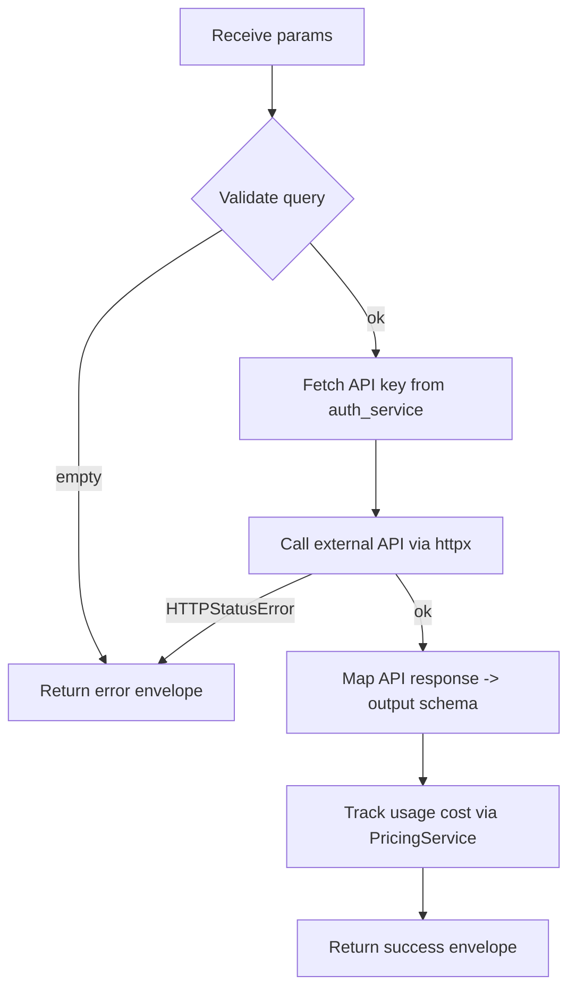

<!--
PER-NODE LOGIC FLOW TEMPLATE
============================
Replace every <placeholder>. Keep sections in this order so the index builder
can scrape consistently. One file per node, named <nodeName>.md (camelCase
matching the registry key, no quotes).

This document is the FROZEN BEHAVIOURAL CONTRACT for one workflow node. After
the upcoming refactor, the corresponding contract test must still pass and
this file must still describe what the code does end-to-end.
-->

# <displayName> (`<nodeType>`)

| Field | Value |
|------|-------|
| **Category** | <group, e.g. search / ai / android / google> |
| **Frontend definition** | [`client/src/nodeDefinitions/<file>.ts`](../../../client/src/nodeDefinitions/<file>.ts) |
| **Backend handler** | [`server/services/handlers/<file>.py::<handler_fn>`](../../../server/services/handlers/<file>.py) |
| **Tests** | [`server/tests/nodes/test_<category>.py`](../../../server/tests/nodes/test_<category>.py) |
| **Skill (if any)** | [`server/skills/<folder>/<skill>/SKILL.md`](../../../server/skills/<folder>/<skill>/SKILL.md) |
| **Dual-purpose tool** | yes / no - tool name `<tool_name>` if yes |

## Purpose

<One paragraph: what the node does, when a user reaches for it, what problem it solves.>

## Inputs (handles)

| Handle | Connection type | Required | Purpose |
|--------|-----------------|----------|---------|
| `input-main` | main | no | Upstream data injected into prompt / params |

## Parameters

| Name | Type | Default | Required | displayOptions.show | Description |
|------|------|---------|----------|---------------------|-------------|
| `query` | string | `""` | yes | - | The search query |

## Outputs (handles)

| Handle | Shape | Description |
|--------|-------|-------------|
| `output-main` | object | Standard envelope payload (see below) |

### Output payload (TypeScript shape)

```ts
{
  query: string;
  results: Array<{ title: string; snippet: string; url: string }>;
  result_count: number;
  provider: string;
}
```

## Logic Flow



## Decision Logic

- **Validation**: <list each early-return case>
- **Branches**: <if/else paths inside the handler that change the shape>
- **Fallbacks**: <defaults applied when params are missing>
- **Error paths**: <each catch block, what error string it returns>

## Side Effects

- **Database writes**: <table + columns, e.g. `api_usage_metrics` row per call>
- **Broadcasts**: <`update_node_status`, `broadcast_terminal_log`, etc.>
- **External API calls**: <endpoint + auth header>
- **File I/O**: <paths written / read>
- **Subprocess**: <if the handler spawns one>

## External Dependencies

- **Credentials**: <provider key looked up via `auth_service.get_api_key('<provider>')`>
- **Services**: <e.g. WhatsApp RPC at `localhost:9400`, agent-browser CLI>
- **Python packages**: <e.g. `httpx`, `xdk`, `apify-client`>
- **Environment variables**: <if any>

## Edge cases & known limits

- <e.g. Brave Search caps `count` at 100>
- <e.g. Perplexity has no streaming - full response only>
- <e.g. handler swallows network errors and returns `success=false`>

## Related

- **Skills using this as a tool**: <links to SKILL.md files>
- **Other nodes that consume this output**: <if there is a typical downstream node>
- **Architecture docs**: <relevant docs-internal links>
