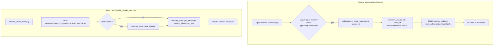

# Simple Memory (`simpleMemory`)

| Field | Value |
|------|-------|
| **Category** | ai_agents / memory (UI group: `['tool', 'memory']`) |
| **Frontend definition** | [`client/src/nodeDefinitions/aiAgentNodes.ts`](../../../client/src/nodeDefinitions/aiAgentNodes.ts) |
| **Backend handler** | [`server/services/handlers/ai.py::handle_simple_memory`](../../../server/services/handlers/ai.py) |
| **Tests** | [`server/tests/nodes/test_ai_agents.py`](../../../server/tests/nodes/test_ai_agents.py) |
| **Skill (if any)** | n/a |
| **Dual-purpose tool** | no |

## Purpose

`simpleMemory` is a **passive configuration node** that holds conversation
history for connected agents. It has no inputs and is not meant to be run on
its own - it has no Run button in the UI. When an `aiAgent` / `chatAgent`
(or any specialized agent) executes, `_collect_agent_connections` reads this
node's saved parameters (`memoryContent`, `windowSize`, `longTermEnabled`,
etc.) and forwards them to `AIService.execute_agent` /
`execute_chat_agent`. The service parses the markdown, feeds the messages to
the LLM, appends the new exchange, trims to window, and saves the updated
markdown back to the memory node via `database.save_node_parameters`.

The actual handler (`handle_simple_memory`) is only invoked when a user
explicitly hits Run on the node; it returns an inspector-style snapshot of
the `services.memory_store` in-memory session, **which is a separate legacy
store from the markdown pipeline used by the agents**. See "Edge cases"
below.

## Inputs (handles)

_None._ `simpleMemory` has no incoming handles.

## Parameters

| Name | Type | Default | Required | displayOptions.show | Description |
|------|------|---------|----------|---------------------|-------------|
| `sessionId` | string | `""` | no | - | Session override. Empty or `default` -> agent node_id is used instead (see Decision Logic). |
| `windowSize` | number | `100` | no | - | Message *pairs* to keep in short-term memory; 1-100. |
| `memoryContent` | string | `# Conversation History\n\n*No messages yet.*\n` | no | - | Markdown body (`### **Human** (ts)` / `### **Assistant** (ts)` blocks). Edited in-place in the UI. |
| `longTermEnabled` | boolean | `false` | no | - | When true, trimmed messages are archived to an `InMemoryVectorStore`. |
| `retrievalCount` | number | `3` | no | `longTermEnabled=true` | Relevant messages to retrieve at query time (1-10). |

Parameters consumed when an agent pulls the memory:

| Name | Where it comes from | Where it is read |
|------|---------------------|------------------|
| `sessionId`, `windowSize`, `memoryContent`, `longTermEnabled`, `retrievalCount` | `database.get_node_parameters(source_node_id)` inside `_collect_agent_connections` | Packed into `memory_data` dict and forwarded to `AIService`. |

Parameters consumed when the node is run directly:

| Name | Type | Default | Description |
|------|------|---------|-------------|
| `sessionId` | string | `default` | Session key used for `services.memory_store`. |
| `memoryType` | string | `buffer` | Either `buffer` (all messages) or `window`. |
| `windowSize` | number | `10` | Window size; only applied when `memoryType == 'window'`. |
| `clearOnRun` | boolean | `false` | When true, clears the session before returning. |

## Outputs (handles)

| Handle | Shape | Description |
|--------|-------|-------------|
| `output-memory` (`main` type) | object | Snapshot of the in-memory session (see below). |

### Output payload (from `handle_simple_memory`)

```ts
{
  session_id: string;
  messages: Array<{ role: 'human' | 'ai'; content: string; timestamp: string }>;
  message_count: number;
  memory_type: 'buffer' | 'window';
  window_size: number | null;
}
```

Wrapped in the standard envelope: `{ success: true, result: <payload> }`.

## Logic Flow



## Decision Logic

- **Passive collection session key**: if the memory node's `sessionId` is
  empty or literally `"default"`, the agent's own `node_id` is used as the
  session key. This is what makes two agents wired to the same memory node
  keep **separate** histories unless the user explicitly overrides
  `sessionId`.
- **Instruction source of truth**: `memoryContent` in the DB is authoritative.
  UI edits persist there via `save_node_parameters`. The agent side
  re-serialises after each turn through `AIService._append_to_memory_markdown`
  + `_trim_markdown_window`.
- **Window semantics**: `windowSize` counts *pairs* (Human + Assistant), so
  `_trim_markdown_window` keeps `window_size * 2` blocks. Trimmed blocks are
  returned as raw text for optional vector-store archival.
- **Long-term retrieval**: `_get_memory_vector_store(session_id)` lazily
  creates an `InMemoryVectorStore` with `HuggingFaceEmbeddings(BAAI/bge-small-en-v1.5)`
  the first time it is requested for that session. On `ImportError` (e.g.
  `langchain_huggingface` missing) the function returns `None` and the agent
  silently skips archival - **no error is surfaced**.
- **Direct-run memory store is different**: `handle_simple_memory` pulls
  from `services.memory_store._sessions`, **not** from the markdown
  `memoryContent`. A user who clicks Run on a `simpleMemory` node that is
  actively used by an agent will see the `memory_store` view, which may be
  empty even though `memoryContent` contains history.

## Side Effects

- **Database writes**: none in the handler. The agent pipeline writes the
  updated markdown back to this node's `node_parameters` row via
  `database.save_node_parameters` after each turn.
- **Broadcasts**: none. The node is passive.
- **External API calls**: none in the handler. When `longTermEnabled` is set
  and the agent archives, `HuggingFaceEmbeddings` loads the
  `BAAI/bge-small-en-v1.5` model locally (no network once cached).
- **File I/O**: none. The vector store is `InMemoryVectorStore` - not
  persisted to disk; it is lost on process restart.
- **Subprocess**: none.

## External Dependencies

- **Credentials**: none.
- **Services**: `services.memory_store` (direct-run path), `AIService` (via
  agents), `Database` (for parameter persistence).
- **Python packages**: `langchain-core` (messages), `langchain_huggingface`
  + `sentence-transformers` (long-term vector store only, optional).
- **Environment variables**: none.

## Edge cases & known limits

- **Two storage systems for one node**. The markdown `memoryContent` (used
  by agents) and the `services.memory_store._sessions` dict (used by the
  direct-run handler) are **independent**. Clicking Run on the node does not
  reflect what the agents see, and vice-versa. This is a known architectural
  seam noted in the CLAUDE.md overview.
- **Vector store is in-memory only**. `_memory_vector_stores` is a module-
  global dict keyed by session id. A server restart empties it; long-term
  memory is not actually durable without external persistence.
- **`HuggingFaceEmbeddings` import is silent-catch**. If the dependency is
  missing at runtime, `_get_memory_vector_store` logs a warning and returns
  `None`; the agent continues without archival and the user never learns.
- **No token budgeting**. `windowSize` is a message-pair count, not a token
  count. A long history below the window threshold can still exceed the
  model's context window; see the "Prompt Too Long" note in CLAUDE.md.
- **`clearOnRun=true` only affects direct-run**, not the markdown used by
  connected agents.
- **Markdown parser is regex-based**. `_parse_memory_markdown` matches
  `### **Human**` / `### **Assistant**` exactly. If a user edits the UI
  content to a non-conforming header the messages will silently be dropped.
- **`windowSize` UI cap is 100**, but the handler accepts any int. The
  agent-side `_trim_markdown_window` trusts whatever the parameter contains.
- **Passive node, no envelope on read paths**. When consumed by an agent,
  this node never produces its own envelope - it only supplies parameters.

## Related

- **Consumer nodes**: [`aiAgent`](./aiAgent.md), [`chatAgent`](./chatAgent.md),
  every specialized agent that routes to `handle_chat_agent`.
- **Architecture docs**: [Memory Compaction](../../memory_compaction.md),
  [Agent Architecture](../../agent_architecture.md)
