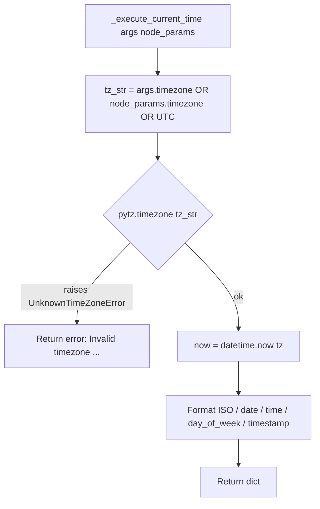

# Current Time Tool (`currentTimeTool`)

| Field | Value |
|------|-------|
| **Category** | ai_tools (dedicated AI tool) |
| **Backend handler** | [`server/services/handlers/tools.py::_execute_current_time`](../../../server/services/handlers/tools.py) |
| **Tests** | [`server/tests/nodes/test_ai_tools.py`](../../../server/tests/nodes/test_ai_tools.py) |
| **Skill (if any)** | None |
| **Dual-purpose tool** | tool-only - LLM invokes as `get_current_time` (configurable via `toolName` param) |

## Purpose

Provides the current date, time, day-of-week, and unix timestamp in a
caller-specified timezone. Intended for AI Agents that need temporal grounding
(e.g., "what day is it today?" before scheduling something). Pure wrapper
around `datetime.now(tz)` with `pytz` for tz resolution.

## Inputs (handles)

| Handle | Connection type | Required | Purpose |
|--------|-----------------|----------|---------|
| (none) | - | - | Passive node |

## Parameters

| Name | Type | Default | Required | displayOptions.show | Description |
|------|------|---------|----------|---------------------|-------------|
| `toolName` | string | `get_current_time` | yes | - | LLM-visible tool name |
| `toolDescription` | string | (see frontend) | no | - | LLM-visible description |
| `timezone` | string | `UTC` | no | - | Default timezone used if the LLM does not pass one |

### LLM-provided tool args (at invocation time)

| Arg | Type | Description |
|-----|------|-------------|
| `timezone` | string? | IANA name (`UTC`, `America/New_York`, `Europe/London`, ...). When omitted or empty, handler falls back to the node's `timezone` parameter. |

## Outputs (handles)

| Handle | Shape | Description |
|--------|-------|-------------|
| `output-tool` | object | Raw dict returned to the LLM |

### Output payload (TypeScript shape)

On success:
```ts
{
  datetime: string;     // ISO 8601 with offset, e.g. "2026-04-15T12:00:00+00:00"
  date: string;         // "YYYY-MM-DD"
  time: string;         // "HH:MM:SS"
  timezone: string;     // echoed back (the resolved string, not the tz object)
  day_of_week: string;  // "Monday" ... "Sunday"
  timestamp: number;    // unix seconds, integer
}
```

On invalid timezone:
```ts
{ error: string }  // "Invalid timezone: <tz>. Error: <details>"
```

## Logic Flow



## Decision Logic

- **Timezone resolution**: `args.timezone` wins if truthy; otherwise
  `node_params.timezone`; otherwise the string literal `'UTC'`.
- **Invalid timezone**: caught by the outer `except Exception` and returned
  as `{error: "Invalid timezone: <tz>. Error: <str>"}` (no raise).
- **Empty string**: an empty `timezone` arg is falsy so falls back to
  `node_params.timezone`; an empty node param then falls back to `'UTC'`.

## Side Effects

- **Database writes**: none.
- **Broadcasts**: none.
- **External API calls**: none.
- **File I/O**: none.
- **Subprocess**: none.

## External Dependencies

- **Credentials**: none.
- **Services**: none.
- **Python packages**: `pytz`, `datetime` (stdlib).
- **Environment variables**: none.

## Edge cases & known limits

- `timestamp` is truncated to integer seconds via `int(now.timestamp())` -
  millisecond precision is lost.
- `timezone` field in the output is the input string, not the canonical
  zone name `pytz` may have normalised to (e.g. aliases are not rewritten).
- If the server system clock is wrong, output is wrong. No NTP sync.
- `pytz.UnknownTimeZoneError` is the typical failure mode; any other
  unexpected exception (e.g. strftime locale issues) is also swallowed.

## Related

- **Sibling tools**: [`calculatorTool`](./calculatorTool.md), [`duckduckgoSearch`](./duckduckgoSearch.md), [`taskManager`](./taskManager.md), [`writeTodos`](./writeTodos.md)
- **Architecture docs**: [Agent Architecture](../../agent_architecture.md)
