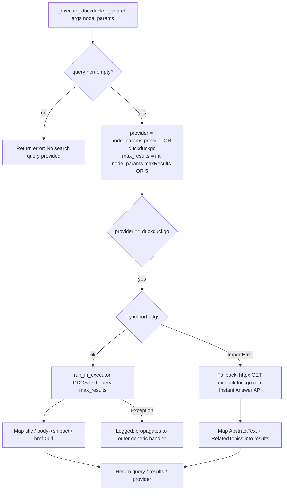

# DuckDuckGo Search (`duckduckgoSearch`)

| Field | Value |
|------|-------|
| **Category** | ai_tools (dedicated AI tool) |
| **Backend handler** | [`server/services/handlers/tools.py::_execute_duckduckgo_search`](../../../server/services/handlers/tools.py) |
| **Tests** | [`server/tests/nodes/test_ai_tools.py`](../../../server/tests/nodes/test_ai_tools.py) |
| **Skill (if any)** | [`server/skills/web_agent/duckduckgo-search-skill/SKILL.md`](../../../server/skills/web_agent/duckduckgo-search-skill/SKILL.md) |
| **Dual-purpose tool** | tool-only - LLM invokes as `web_search` (configurable via `toolName` param) |

## Purpose

Free web search with no API key required. Wraps the `ddgs` Python library's
`DDGS().text(query, max_results=N)` call. Designed as the zero-configuration
default web search tool for AI Agents, complementing the keyed alternatives
(`braveSearch`, `serperSearch`, `perplexitySearch`).

## Inputs (handles)

| Handle | Connection type | Required | Purpose |
|--------|-----------------|----------|---------|
| (none) | - | - | Passive node |

## Parameters

| Name | Type | Default | Required | displayOptions.show | Description |
|------|------|---------|----------|---------------------|-------------|
| `toolName` | string | `web_search` | yes | - | LLM-visible tool name |
| `toolDescription` | string | (see frontend) | no | - | LLM-visible description |
| `maxResults` | number | `5` | no | - | Result cap (frontend clamps `1..10`); cast to `int` in handler |

### LLM-provided tool args (at invocation time)

| Arg | Type | Description |
|-----|------|-------------|
| `query` | string | Search query; empty string short-circuits with an error |

## Outputs (handles)

| Handle | Shape | Description |
|--------|-------|-------------|
| `output-tool` | object | Raw dict returned to the LLM |

### Output payload (TypeScript shape)

On success:
```ts
{
  query: string;
  results: Array<{ title: string; snippet: string; url: string }>;
  provider: 'duckduckgo';
}
```

On empty query:
```ts
{ error: 'No search query provided' }
```

## Logic Flow



## Decision Logic

- **Empty query**: `if not query: return {error: ...}` - no library call.
- **Provider switch**: `node_params.provider` defaults to `'duckduckgo'` and
  the handler only implements that branch. Any other value falls through
  without raising (returns whatever the outer try returns, typically nothing
  useful). The frontend node does not expose `provider`, so in practice this
  branch is always taken.
- **`ddgs` ImportError fallback**: the handler quietly falls back to the
  DuckDuckGo Instant Answer API (`api.duckduckgo.com`) via `httpx`, which
  returns a very different shape (abstracts + related topics, not ranked web
  results). Shown logs: `"ddgs not installed, falling back to Instant Answer API"`.
- **Sync-in-async**: `DDGS().text(...)` is synchronous; handler wraps it in
  `loop.run_in_executor(None, ...)` to avoid blocking the event loop.

## Side Effects

- **Database writes**: none. (Unlike `braveSearch`/`serperSearch`/`perplexitySearch`,
  this handler does **not** write to `api_usage_metrics` - it is free and
  tracking cost is skipped.)
- **Broadcasts**: none.
- **External API calls**:
  - Primary: `ddgs` library (HTTPS to `duckduckgo.com`; the library manages
    its own networking, timeout, and rate limits).
  - Fallback: `GET https://api.duckduckgo.com/?q=<query>&format=json&no_html=1`
    (timeout 10s) via `httpx.AsyncClient`.
- **File I/O**: none.
- **Subprocess**: none.

## External Dependencies

- **Credentials**: none.
- **Services**: none.
- **Python packages**: `ddgs` (preferred), `httpx` (fallback).
- **Environment variables**: none.

## Edge cases & known limits

- Handler does **not** wrap network errors from `ddgs` - they propagate up to
  `execute_tool`, which will bubble them into the tool-call result as an
  uncaught exception. (Mocking the library in tests is therefore required.)
- Missing `ddgs` silently switches to Instant Answer API, which returns a
  noticeably smaller and differently-structured result set (abstract +
  related topics, not ranked web results). The `provider` field still says
  `"duckduckgo"`, masking the fallback.
- `maxResults` clamp (`1..10`) is enforced only by the frontend; an LLM could
  in theory pass `node_params.maxResults = 999` via stored defaults and the
  handler would honour it.
- `results[].url` uses the `href` field from `ddgs`; older library versions
  used a different key - the handler fills missing keys with `""` to stay
  defensive.

## Related

- **Sibling tools**: [`calculatorTool`](./calculatorTool.md), [`currentTimeTool`](./currentTimeTool.md), [`taskManager`](./taskManager.md), [`writeTodos`](./writeTodos.md)
- **Companion search nodes** (API-keyed, track cost): [`braveSearch`](../search/braveSearch.md), [`serperSearch`](../search/serperSearch.md), [`perplexitySearch`](../search/perplexitySearch.md)
- **Skill using this tool**: [`duckduckgo-search-skill/SKILL.md`](../../../server/skills/web_agent/duckduckgo-search-skill/SKILL.md)
