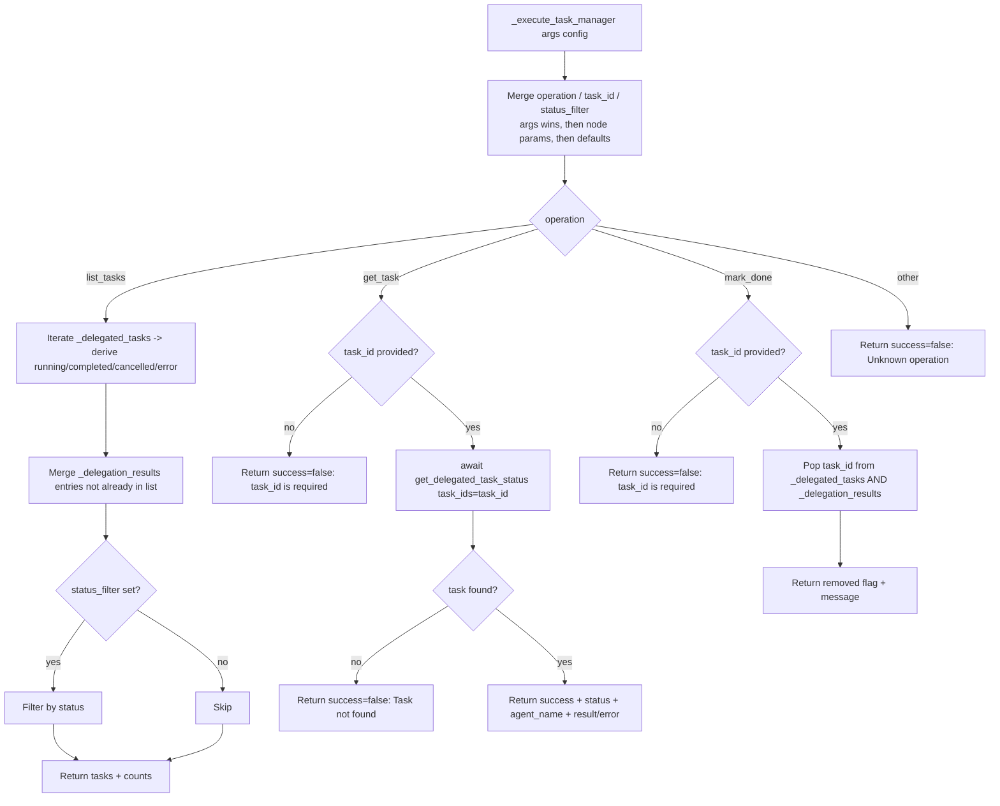

# Task Manager (`taskManager`)

| Field | Value |
|------|-------|
| **Category** | ai_tools (dual-purpose) |
| **Backend handler** | [`server/services/handlers/tools.py::handle_task_manager`](../../../server/services/handlers/tools.py) (workflow-node entry) -> `_execute_task_manager` |
| **Tests** | [`server/tests/nodes/test_ai_tools.py`](../../../server/tests/nodes/test_ai_tools.py) |
| **Skill (if any)** | [`server/skills/task_agent/task-manager-skill/SKILL.md`](../../../server/skills/task_agent/task-manager-skill/SKILL.md) |
| **Dual-purpose tool** | yes - tool name `task_manager`; handler registered under both registry key `taskManager` and `execute_tool` dispatch |

## Purpose

Inspects the in-process registry of delegated agent tasks (`_delegated_tasks`
and `_delegation_results` dicts in `tools.py`). Lets a parent agent (or a
workflow node run) list currently-running / completed delegations, fetch
details for a specific `task_id`, or clear a finished task from tracking.
Does **not** spawn work itself; it only reads/mutates the delegation state
populated by `_execute_delegated_agent`.

## Inputs (handles)

| Handle | Connection type | Required | Purpose |
|--------|-----------------|----------|---------|
| (none) | - | - | Passive node |

## Parameters

| Name | Type | Default | Required | displayOptions.show | Description |
|------|------|---------|----------|---------------------|-------------|
| `toolName` | string | `task_manager` | no | - | LLM-visible tool name |
| `toolDescription` | string | (see frontend) | no | - | LLM-visible description |
| `operation` | options | `list_tasks` | no | - | One of `list_tasks`, `get_task`, `mark_done` (workflow-node mode) |
| `task_id` | string | `""` | no | `operation in [get_task, mark_done]` | Target task id |
| `status_filter` | options | `""` | no | `operation == list_tasks` | One of `""`, `running`, `completed`, `error` |

### LLM-provided tool args (when used as a tool)

| Arg | Type | Description |
|-----|------|-------------|
| `operation` | string | Same three values; falls back to node param, then to `'list_tasks'` |
| `task_id` | string | Required for `get_task` / `mark_done`; otherwise ignored |
| `status_filter` | string | Optional filter applied to `list_tasks` |

## Outputs (handles)

| Handle | Shape | Description |
|--------|-------|-------------|
| `output-tool` | object | Raw dict returned to the LLM |
| `output-main` | object | Same payload, available when run as a workflow node |

### Output payload (TypeScript shape)

`list_tasks`:
```ts
{
  success: true;
  operation: 'list_tasks';
  tasks: Array<{
    task_id: string;
    status: 'running' | 'completed' | 'error' | 'cancelled';
    active: boolean;           // true = still in _delegated_tasks
    agent_name?: string;       // only present for entries from _delegation_results
    result_summary?: string;   // truncated to 200 chars
  }>;
  count: number;
  running: number;
  completed: number;
  errors: number;
}
```

`get_task`:
```ts
{
  success: boolean;
  operation: 'get_task';
  task_id: string;
  status?: string;
  agent_name?: string;
  result?: unknown;
  error?: string;
}
```

`mark_done`:
```ts
{
  success: true;
  operation: 'mark_done';
  task_id: string;
  removed: boolean;
  message: string;
}
```

Unknown operation: `{success: false, error: "Unknown operation: <op>"}`.

## Logic Flow



## Decision Logic

- **Operation resolution**: `tool_args.operation OR node_params.operation OR 'list_tasks'`.
- **list_tasks status derivation**: for each entry in `_delegated_tasks`,
  `task.done()` is checked; if done, `cancelled()` / `exception()` determine
  `cancelled` vs `error` vs `completed`; otherwise `running`.
- **De-duplication**: `_delegation_results` entries whose `task_id` is
  already in the `_delegated_tasks`-derived list are skipped.
- **status_filter**: an empty string means "all"; the check
  `if status_filter:` treats `""` as falsy, so no filter is applied.
- **get_task missing id**: returns `{success: false, error: 'task_id is required ...'}`.
- **get_task not found**: `get_delegated_task_status` returns `{tasks: []}`,
  handler returns `{success: false, error: 'Task <id> not found'}`.
- **mark_done missing id**: same `task_id is required` short-circuit.
- **mark_done when not tracked**: still returns `success=true` but with
  `removed=false` and a "was not in active tracking" message.

## Side Effects

- **In-memory state writes**: `mark_done` deletes entries from the
  module-level dicts `_delegated_tasks` and `_delegation_results`
  (in `services/handlers/tools.py`).
- **Database writes**: none directly. `get_task` calls
  `get_delegated_task_status`, which may read from `database` (if supplied),
  but there is no write from `taskManager`.
- **Broadcasts**: none.
- **External API calls**: none.
- **File I/O**: none.
- **Subprocess**: none.

## External Dependencies

- **Credentials**: none.
- **Services**: `database` (optional) passed through from `context` for
  `get_delegated_task_status`.
- **Python packages**: stdlib only.
- **Environment variables**: none.

## Edge cases & known limits

- State is **process-local** (module-level dicts). A restart wipes all
  tracked tasks; a horizontally-scaled deployment never sees tasks spawned
  on a different worker.
- `result_summary` is truncated to 200 characters via `str(...)[:200]`;
  multi-line results may be cut mid-line.
- `list_tasks` counts only `running` / `completed` / `error` explicitly -
  `cancelled` entries are included in `tasks` but not counted in any of the
  three aggregate counters.
- Unknown `operation` returns a failed envelope rather than raising; the
  agent might keep retrying with the same bad operation string.
- `handle_task_manager` (workflow-node entry) passes an empty `tool_args`
  dict and relies entirely on node parameters.

## Related

- **Sibling tools**: [`calculatorTool`](./calculatorTool.md), [`currentTimeTool`](./currentTimeTool.md), [`duckduckgoSearch`](./duckduckgoSearch.md), [`writeTodos`](./writeTodos.md)
- **Skill using this tool**: [`task-manager-skill/SKILL.md`](../../../server/skills/task_agent/task-manager-skill/SKILL.md)
- **Architecture docs**: [Agent Delegation](../../agent_delegation.md)
