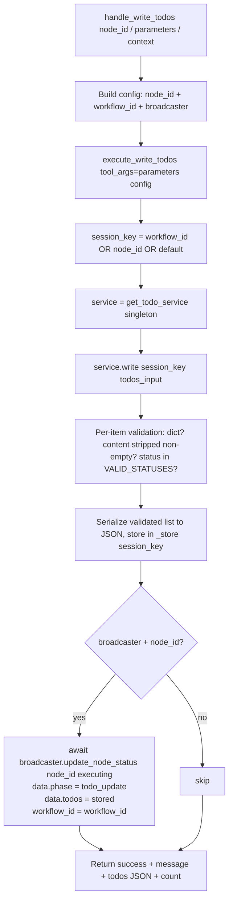

# Write Todos (`writeTodos`)

| Field | Value |
|------|-------|
| **Category** | ai_tools (dual-purpose) |
| **Frontend definition** | [`client/src/nodeDefinitions/toolNodes.ts`](../../../client/src/nodeDefinitions/toolNodes.ts) |
| **Backend handler** | [`server/services/handlers/todo.py::handle_write_todos`](../../../server/services/handlers/todo.py) (workflow) / `execute_write_todos` (tool) |
| **Service** | [`server/services/todo_service.py::TodoService`](../../../server/services/todo_service.py) |
| **Tests** | [`server/tests/nodes/test_ai_tools.py`](../../../server/tests/nodes/test_ai_tools.py) |
| **Skill (if any)** | [`server/skills/task_agent/write-todos-skill/SKILL.md`](../../../server/skills/task_agent/write-todos-skill/SKILL.md) |
| **Dual-purpose tool** | yes - tool name `write_todos` |

## Purpose

Lets an AI Agent maintain a structured, per-session checklist while working
on a multi-step task. Each call **replaces** the entire todo list for the
session with the new snapshot the agent produces, then broadcasts the new
state over WebSocket so the UI can render a live checklist. Storage is an
in-process `TodoService` singleton keyed by `workflow_id` (or `node_id` as
fallback).

## Inputs (handles)

| Handle | Connection type | Required | Purpose |
|--------|-----------------|----------|---------|
| (none) | - | - | Passive node - connect `output-tool` to an AI Agent's `input-tools` |

## Parameters

| Name | Type | Default | Required | displayOptions.show | Description |
|------|------|---------|----------|---------------------|-------------|
| `toolName` | string | `write_todos` | no | - | LLM-visible tool name |
| `toolDescription` | string | (see frontend, 3-row hint) | no | - | LLM-visible description |

### LLM-provided tool args (at invocation time)

| Arg | Type | Description |
|-----|------|-------------|
| `todos` | `Array<{content: string, status: 'pending' \| 'in_progress' \| 'completed'}>` | Full replacement snapshot of the todo list |

## Outputs (handles)

| Handle | Shape | Description |
|--------|-------|-------------|
| `output-tool` | object | Tool result returned to the LLM |
| `output-main` | object | Same payload, available when run as a workflow node |

### Output payload (TypeScript shape)

```ts
{
  success: true;
  message: string;   // "Updated todo list (<N> items)"
  todos: string;     // JSON string of the validated list
  count: number;     // len(stored)
}
```

## Logic Flow



## Decision Logic

- **Session key**: `workflow_id` if truthy, else `node_id`, else literal
  `"default"`.
- **Empty / malformed items dropped**:
  - Non-dict entries: skipped silently.
  - `content.strip() == ""`: skipped silently.
  - `status` not in `{pending, in_progress, completed}`: coerced to
    `"pending"`.
- **Full replacement semantics**: each call overwrites `_store[session_key]`
  entirely - there is no merge / append. Agents are expected to send the
  complete snapshot.
- **Broadcast guarded**: `update_node_status` is called only when both
  `broadcaster` and `node_id` are truthy, so direct invocations without a
  broadcaster still succeed silently.
- **Status `"executing"`** (not `"success"`): the broadcast uses the status
  string `"executing"` with `data.phase = "todo_update"`, which the frontend
  uses to refresh the checklist without moving the node out of its current
  execution state.

## Side Effects

- **In-memory state writes**: `TodoService._store[session_key] = json.dumps(validated)`.
  State persists for the lifetime of the Python process only.
- **Database writes**: none.
- **Broadcasts**: `StatusBroadcaster.update_node_status(node_id, "executing",
  {"phase": "todo_update", "todos": [...]}, workflow_id=workflow_id)` - one
  per successful write, when a broadcaster is present in context.
- **External API calls**: none.
- **File I/O**: none.
- **Subprocess**: none.

## External Dependencies

- **Credentials**: none.
- **Services**: `TodoService` singleton (`get_todo_service()`);
  `StatusBroadcaster` via `context['broadcaster']`.
- **Python packages**: stdlib `json` only.
- **Environment variables**: none.

## Edge cases & known limits

- **Process-local state**: a server restart clears every todo list.
  Horizontal scaling never shares state across workers.
- **No TTL / cleanup**: sessions accumulate forever in `_store` unless
  `TodoService.clear(session_key)` is called explicitly (no caller does this
  today).
- **All validation silent**: dropping an item with empty content or coercing
  an invalid status never produces a warning in the return payload - only a
  DEBUG log line.
- **Broadcast failures swallowed by caller**: `handle_write_todos` awaits
  `update_node_status`; if the broadcaster raises, the exception bubbles up
  to the executor (no `try/except` inside the handler).
- **`todos` returned as a JSON string, not an object**: the LLM must parse
  it again. This matches Claude Code's `TodoWrite` tool convention.
- **Content is trimmed** (`.strip()`) but otherwise not sanitised - markdown
  or HTML in content survives untouched.

## Related

- **Sibling tools**: [`calculatorTool`](./calculatorTool.md), [`currentTimeTool`](./currentTimeTool.md), [`duckduckgoSearch`](./duckduckgoSearch.md), [`taskManager`](./taskManager.md)
- **Skill using this tool**: [`write-todos-skill/SKILL.md`](../../../server/skills/task_agent/write-todos-skill/SKILL.md)
- **Architecture docs**: [Status Broadcaster](../../status_broadcaster.md), [Agent Architecture](../../agent_architecture.md)
