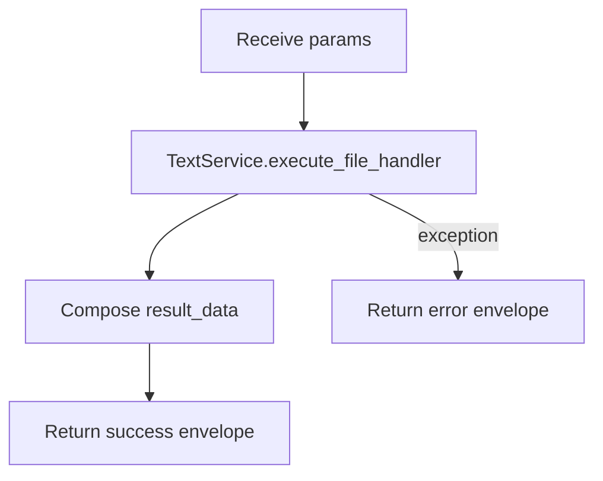

# File Handler (`fileHandler`)

| Field | Value |
|------|-------|
| **Category** | chat_utility |
| **Frontend definition** | not exposed in `client/src/nodeDefinitions/` (backend-only registry entry) |
| **Backend handler** | [`server/services/handlers/utility.py::handle_file_handler`](../../../server/services/handlers/utility.py) |
| **Tests** | [`server/tests/nodes/test_chat_utility.py`](../../../server/tests/nodes/test_chat_utility.py) |
| **Skill (if any)** | - |
| **Dual-purpose tool** | no |

## Purpose

Legacy file-shape wrapper retained from the Node.js-era engine. Does NOT touch
the filesystem - it only composes a descriptive dict (`fileName`, `fileType`,
`content`, `size`) around an already-in-memory string. For real filesystem
access use the `fileRead`, `fileModify`, `fsSearch`, and `fileDownloader`
nodes in the `code_fs_process` and `document` categories.

## Inputs (handles)

| Handle | Connection type | Required | Purpose |
|--------|-----------------|----------|---------|
| `input-main` | main | no | Upstream text/JSON used via templates |

## Parameters

| Name | Type | Default | Required | displayOptions.show | Description |
|------|------|---------|----------|---------------------|-------------|
| `fileType` | string | `generic` | no | - | Arbitrary tag stored in output |
| `content` | string | `""` | no | - | In-memory file contents |
| `fileName` | string | `untitled.txt` | no | - | Display file name |

## Outputs (handles)

| Handle | Shape | Description |
|--------|-------|-------------|
| `output-main` | object | `{ type: "file", data: {...}, nodeId, timestamp }` |

### Output payload (TypeScript shape)

```ts
{
  type: "file";
  data: {
    fileName: string;
    fileType: string;
    content: string;
    size: number;          // len(content), bytes-of-str length
    processed: true;
    processingType: string; // === fileType
    nodeId: string;
  };
  nodeId: string;
  timestamp: string;
}
```

## Logic Flow



## Decision Logic

- **Validation**: none.
- **Branches**: none; the handler is effectively a pure data-shape wrapper.
- **Fallbacks**: all three params have defaults.
- **Error paths**: any exception inside `TextService.execute_file_handler` is
  caught and returned as `success=false`.

## Side Effects

- **Database writes**: none.
- **Broadcasts**: none.
- **External API calls**: none.
- **File I/O**: none (despite the name).
- **Subprocess**: none.

## External Dependencies

- **Credentials**: none.
- **Services**: `TextService` injected via `functools.partial` in
  `NodeExecutor._build_handler_registry`.
- **Python packages**: stdlib only.
- **Environment variables**: none.

## Edge cases & known limits

- `processed` is hard-coded to `true` regardless of input.
- `processingType` duplicates `fileType`; there is no actual processing logic.
- `size` is `len(content)` on the string (character count, not byte count of
  an encoded representation).
- Not a real filesystem node; misleading name retained for backward
  compatibility with older workflow JSON.

## Related

- **Skills using this as a tool**: none.
- **Other nodes that consume this output**: any templating downstream.
- **Architecture docs**: see `docs-internal/node-logic-flows/code_fs_process/`
  for the real filesystem nodes (`fileRead`, `fileModify`, `fsSearch`).
