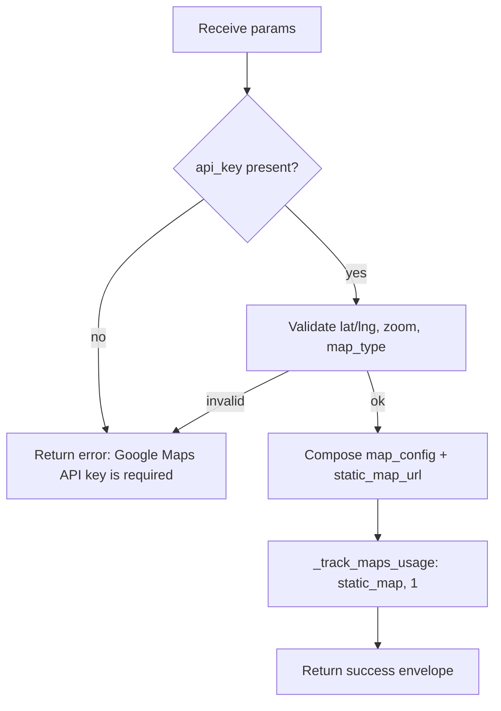

# Create Map (`gmaps_create`)

| Field | Value |
|------|-------|
| **Category** | chat_utility (grouping) / location (functional domain) |
| **Frontend definition** | [`client/src/nodeDefinitions/locationNodes.ts`](../../../client/src/nodeDefinitions/locationNodes.ts) |
| **Backend handler** | [`server/services/handlers/utility.py::handle_create_map`](../../../server/services/handlers/utility.py) -> [`server/services/maps.py::MapsService.create_map`](../../../server/services/maps.py) |
| **Tests** | [`server/tests/nodes/test_chat_utility.py`](../../../server/tests/nodes/test_chat_utility.py) |
| **Skill (if any)** | - |
| **Dual-purpose tool** | no (display-only; `gmaps_locations` and `gmaps_nearby_places` are the dual-purpose pair) |

## Purpose

Builds a Google Maps configuration (center, zoom, map type) and a Static Maps
URL for display on the canvas or downstream consumers. The node does NOT hit
the Maps API - it assembles the URL from parameters and tracks a
`static_map` usage cost of $0.002 per execution.

## Inputs (handles)

| Handle | Connection type | Required | Purpose |
|--------|-----------------|----------|---------|
| `input-main` | main | no | Upstream lat/lng via templates |

## Parameters

| Name | Type | Default | Required | displayOptions.show | Description |
|------|------|---------|----------|---------------------|-------------|
| `api_key` | string | - | yes (auto-injected) | - | Google Maps API key; auto-injected from `auth_service.get_api_key('google_maps')` or `settings.google_maps_api_key` |
| `lat` | number | `40.7128` | no | - | Latitude, -90 .. 90 |
| `lng` | number | `-74.0060` | no | - | Longitude, -180 .. 180 |
| `zoom` | number | `13` | no | - | Zoom level, 0 .. 21 |
| `map_type_id` | string | `ROADMAP` | no | - | One of `ROADMAP`, `SATELLITE`, `HYBRID`, `TERRAIN` |

## Outputs (handles)

| Handle | Shape | Description |
|--------|-------|-------------|
| `output-main` | object | Map config + static URL |

### Output payload (TypeScript shape)

```ts
{
  map_config: {
    center: { lat: number; lng: number };
    zoom: number;
    mapTypeId: "ROADMAP" | "SATELLITE" | "HYBRID" | "TERRAIN";
  };
  static_map_url: string; // https://maps.googleapis.com/maps/api/staticmap?...
  status: "OK";
}
```

## Logic Flow



## Decision Logic

- **Validation**:
  - `api_key` required (from params, else `settings.google_maps_api_key`).
  - `lat`/`lng` validated via `validate_coordinates`.
  - `zoom` validated via `validate_zoom_level` (0-21).
  - `map_type` restricted to the four Google Maps MapTypeId values.
- **Branches**: success envelope vs error envelope.
- **Fallbacks**: defaults centre the map on New York City.
- **Error paths**: any raised `ValueError` bubbles into the generic
  `except Exception` and returns `success=false`.

## Side Effects

- **Database writes**: `api_usage_metrics` row via `_track_maps_usage` with
  `operation=static_map`, `resource_count=1`, `total_cost=0.002`.
- **Broadcasts**: none.
- **External API calls**: none. The URL is assembled locally and meant to be
  fetched by the frontend or downstream `httpRequest` node.
- **File I/O**: none.
- **Subprocess**: none.

## External Dependencies

- **Credentials**: Google Maps API key via `auth_service.get_api_key('google_maps')`
  or `settings.google_maps_api_key` (env `GOOGLE_MAPS_API_KEY`).
- **Services**: `MapsService` injected via `functools.partial` in
  `NodeExecutor._build_handler_registry`.
- **Python packages**: stdlib only for this path (googlemaps is used by other
  map handlers, not this one).
- **Environment variables**: `GOOGLE_MAPS_API_KEY` (fallback).

## Edge cases & known limits

- The static map URL embeds the API key in plain text - any downstream node or
  log that captures the output leaks the key. Treat the output as sensitive.
- Size is hard-coded to `600x400`; there is no parameter to override.
- `map_type` comparison is case-sensitive; `roadmap` (lowercase) is rejected as
  invalid even though Google Maps accepts it.
- Cost tracking is optimistic: the $0.002 is charged even if the frontend
  never actually fetches the static map URL.

## Related

- **Skills using this as a tool**: none (display-only node).
- **Other nodes that consume this output**: downstream map-display components
  on the frontend, or `httpRequest` for server-side image fetch.
- **Architecture docs**: [`docs-internal/pricing_service.md`](../../pricing_service.md)
  for API cost tracking.
