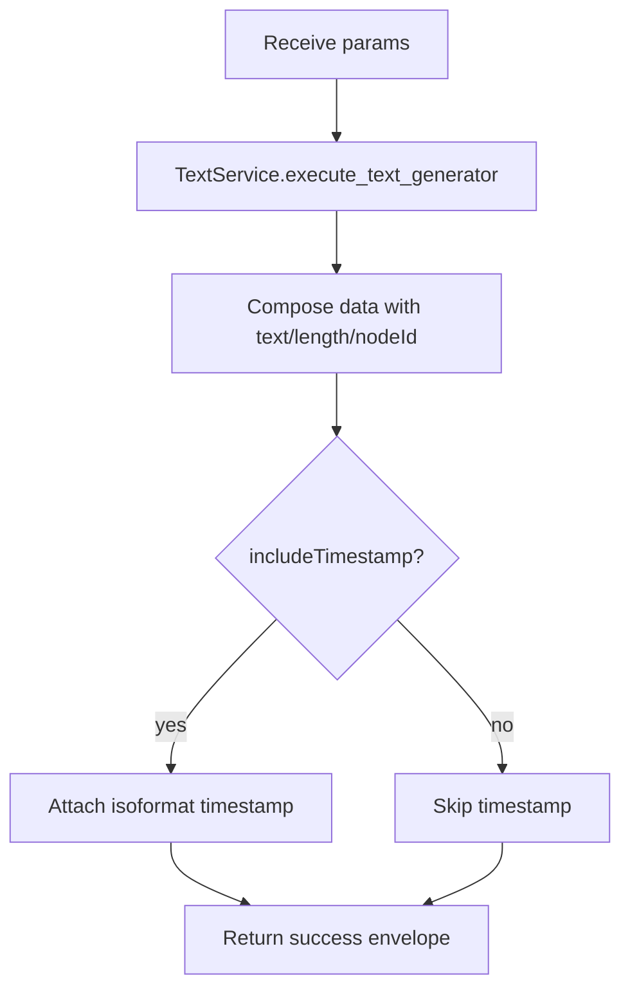

# Text Generator (`textGenerator`)

| Field | Value |
|------|-------|
| **Category** | chat_utility |
| **Frontend definition** | not exposed in `client/src/nodeDefinitions/` (backend-only registry entry) |
| **Backend handler** | [`server/services/handlers/utility.py::handle_text_generator`](../../../server/services/handlers/utility.py) |
| **Tests** | [`server/tests/nodes/test_chat_utility.py`](../../../server/tests/nodes/test_chat_utility.py) |
| **Skill (if any)** | - |
| **Dual-purpose tool** | no |

## Purpose

Trivial text factory node retained from the original Node.js-era workflow
engine. Emits a text string and its length (optionally with a timestamp). Used
by legacy workflows and as a scaffolding node during tests. Not surfaced in the
current React component palette but still reachable through the backend
registry.

## Inputs (handles)

| Handle | Connection type | Required | Purpose |
|--------|-----------------|----------|---------|
| `input-main` | main | no | Upstream value usable via templates in `text` |

## Parameters

| Name | Type | Default | Required | displayOptions.show | Description |
|------|------|---------|----------|---------------------|-------------|
| `text` | string | `Hello World` | no | - | Text payload to emit |
| `includeTimestamp` | boolean | `true` | no | - | Include ISO timestamp in `data` |

## Outputs (handles)

| Handle | Shape | Description |
|--------|-------|-------------|
| `output-main` | object | Wrapper containing `data` with the generated text |

### Output payload (TypeScript shape)

```ts
{
  type: "text";
  data: {
    text: string;
    length: number;
    nodeId: string;
    timestamp?: string; // only when includeTimestamp=true
  };
  nodeId: string;
  timestamp: string;
}
```

## Logic Flow



## Decision Logic

- **Validation**: none; both params have defaults.
- **Branches**: `includeTimestamp` toggles the nested timestamp.
- **Fallbacks**: `text` defaults to `Hello World`.
- **Error paths**: any exception inside `TextService.execute_text_generator`
  is caught there and returned as `success=false`.

## Side Effects

- **Database writes**: none.
- **Broadcasts**: none.
- **External API calls**: none.
- **File I/O**: none.
- **Subprocess**: none.

## External Dependencies

- **Credentials**: none.
- **Services**: `TextService` injected via `functools.partial` in
  `NodeExecutor._build_handler_registry`.
- **Python packages**: stdlib only.
- **Environment variables**: none.

## Edge cases & known limits

- `length` is the Python `len(text)` which counts characters (not bytes), so
  non-ASCII strings report their Unicode code-point count.
- There is no upper bound on `text` length; the entire payload is stored in
  the output store and broadcast to every WS client subscribed to the
  execution run.

## Related

- **Skills using this as a tool**: none.
- **Other nodes that consume this output**: any downstream node that
  templates `{{textGenerator.data.text}}`.
- **Architecture docs**: none.
