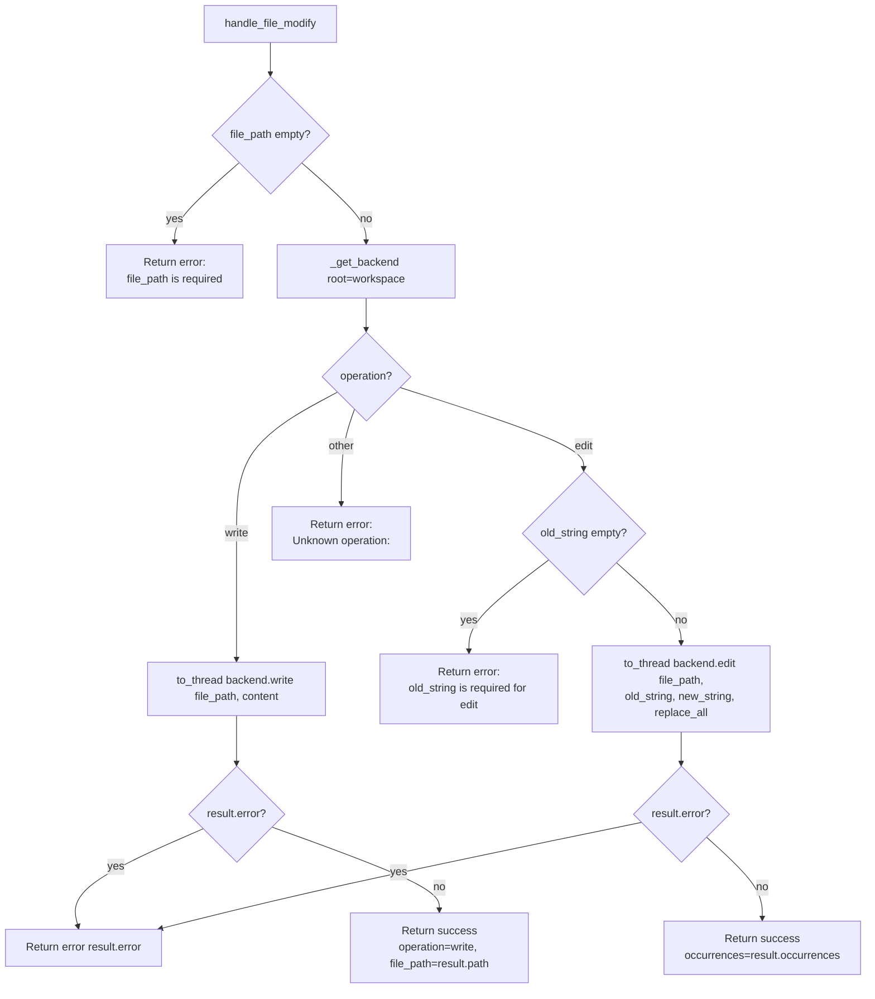

# File Modify (`fileModify`)

| Field | Value |
|------|-------|
| **Category** | code_fs_process / filesystem |
| **Frontend definition** | [`client/src/nodeDefinitions/filesystemNodes.ts`](../../../client/src/nodeDefinitions/filesystemNodes.ts) |
| **Backend handler** | [`server/services/handlers/filesystem.py::handle_file_modify`](../../../server/services/handlers/filesystem.py) |
| **Backend** | [`deepagents.backends.LocalShellBackend`](https://github.com/langchain-ai/deepagents) |
| **Tests** | [`server/tests/nodes/test_code_fs_process.py`](../../../server/tests/nodes/test_code_fs_process.py) |
| **Skill (if any)** | [`server/skills/coding_agent/file-modify-skill/SKILL.md`](../../../server/skills/coding_agent/file-modify-skill/SKILL.md) |
| **Dual-purpose tool** | yes - tool name `file_modify` |

## Purpose

Writes a new file or edits an existing one inside the per-workflow workspace.
Two operations: `write` (create/overwrite) and `edit` (string find-and-replace).
Delegates to `LocalShellBackend.write()` / `backend.edit()` with
`virtual_mode=True` sandboxing, invoked through `asyncio.to_thread()`.

## Inputs (handles)

| Handle | Connection type | Required | Purpose |
|--------|-----------------|----------|---------|
| `input-main` | main | no | Not consumed by the handler |

## Parameters

| Name | Type | Default | Required | displayOptions.show | Description |
|------|------|---------|----------|---------------------|-------------|
| `operation` | options | `write` | no | - | `write` or `edit` |
| `file_path` | string | `""` | yes | - | Target file path |
| `content` | string | `""` | yes (when `operation=write`) | `operation=write` | File content |
| `old_string` | string | `""` | yes (when `operation=edit`) | `operation=edit` | Text to find |
| `new_string` | string | `""` | no | `operation=edit` | Replacement text |
| `replace_all` | boolean | `false` | no | `operation=edit` | Replace every occurrence; when `false` the backend insists `old_string` is unique |
| `working_directory` | string | `""` | no | - | Overrides context workspace |

## Outputs (handles)

| Handle | Shape | Description |
|--------|-------|-------------|
| `output-main` | object | Standard envelope payload |
| `output-tool` | object | Same payload when wired to an AI agent |

### Output payload

Write:
```ts
{ operation: "write"; file_path: string }
```

Edit:
```ts
{ operation: "edit"; file_path: string; occurrences: number }
```

## Logic Flow



## Decision Logic

- **Validation**:
  - empty `file_path` -> `"file_path is required"`.
  - `operation=edit` with empty `old_string` -> `"old_string is required for
    edit"`.
  - Anything other than `write` / `edit` -> `"Unknown operation: <op>"`.
- **Backend-level errors**: both `backend.write()` and `backend.edit()`
  return a result object with an `error` field. A non-empty `error` short-
  circuits before the success envelope is built. Common backend errors:
  non-unique `old_string` when `replace_all=False`, path escape with
  `virtual_mode=True`.
- **`operations.edit` uniqueness constraint**: when `replace_all=False`, the
  backend REQUIRES `old_string` to appear exactly once. Zero or multiple
  matches trigger a backend-level error.
- **`file_path` echoed from `result.path`**: on success the returned
  `file_path` comes from the backend's normalised path, falling back to the
  user-supplied path only if `result.path` is empty.
- **Broad `except Exception`**: catches unexpected backend or I/O errors.

## Side Effects

- **Database writes**: none.
- **Broadcasts**: none.
- **External API calls**: none.
- **File I/O**:
  - `os.makedirs(root, exist_ok=True)` on the workspace root.
  - Writes/edits `<root>/<file_path>`.
- **Subprocess**: none.

## External Dependencies

- **Python packages**: `deepagents`.
- **Environment variables**: `WORKSPACE_BASE_DIR`.

## Edge cases & known limits

- **Silent overwrite on `write`**: there is no "fail if exists" flag - every
  `write` call replaces the file.
- **`edit` without a match**: returns an error envelope (backend surfaces the
  message). The handler never distinguishes "not found" from "multiple
  matches" - both are string errors.
- **No encoding option**: the backend opens files in text mode with the
  platform default encoding.
- **`working_directory` escape**: as in `fileRead`, the node trusts the
  parameter which can bypass the workspace sandbox.
- **`replace_all=true` with empty `new_string`**: effectively deletes every
  occurrence of `old_string`. No safeguard.
- **Atomicity**: the backend does not do atomic writes - a crash mid-write
  can leave a truncated file.

## Related

- **Skills using this as a tool**: [`file-modify-skill/SKILL.md`](../../../server/skills/coding_agent/file-modify-skill/SKILL.md)
- **Sibling nodes**: [`fileRead`](./fileRead.md), [`fsSearch`](./fsSearch.md), [`shell`](./shell.md)
