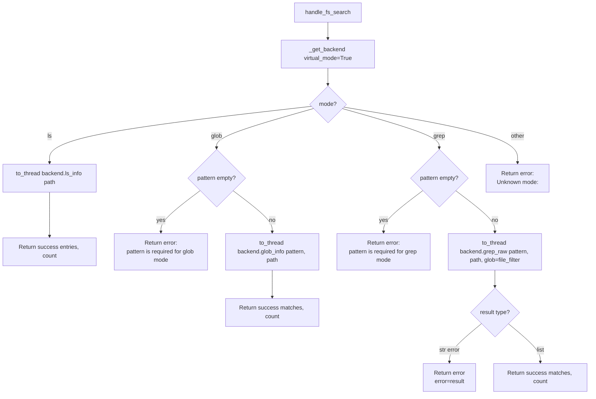

# FS Search (`fsSearch`)

| Field | Value |
|------|-------|
| **Category** | code_fs_process / filesystem |
| **Frontend definition** | [`client/src/nodeDefinitions/filesystemNodes.ts`](../../../client/src/nodeDefinitions/filesystemNodes.ts) |
| **Backend handler** | [`server/services/handlers/filesystem.py::handle_fs_search`](../../../server/services/handlers/filesystem.py) |
| **Backend** | [`deepagents.backends.LocalShellBackend`](https://github.com/langchain-ai/deepagents) (`ls_info`, `glob_info`, `grep_raw`) |
| **Tests** | [`server/tests/nodes/test_code_fs_process.py`](../../../server/tests/nodes/test_code_fs_process.py) |
| **Skill (if any)** | [`server/skills/coding_agent/fs-search-skill/SKILL.md`](../../../server/skills/coding_agent/fs-search-skill/SKILL.md) |
| **Dual-purpose tool** | yes - tool name `fs_search` |

## Purpose

Three-mode filesystem query node confined to the per-workflow workspace.
Dispatches to `ls_info()`, `glob_info()`, or `grep_raw()` on
`LocalShellBackend` (`virtual_mode=True`) depending on `mode`.

## Inputs (handles)

| Handle | Connection type | Required | Purpose |
|--------|-----------------|----------|---------|
| `input-main` | main | no | Not consumed |

## Parameters

| Name | Type | Default | Required | displayOptions.show | Description |
|------|------|---------|----------|---------------------|-------------|
| `mode` | options | `ls` | no | - | `ls`, `glob`, or `grep` |
| `path` | string | `.` | no | - | Directory path to search in (workspace-relative) |
| `pattern` | string | `""` | yes (when `mode != ls`) | `mode=glob`, `mode=grep` | Glob pattern or grep regex |
| `file_filter` | string | `""` | no | `mode=grep` | Glob pattern restricting which files are searched |
| `working_directory` | string | `""` | no | - | Overrides context workspace |

## Outputs (handles)

| Handle | Shape | Description |
|--------|-------|-------------|
| `output-main` | object | Standard envelope payload |
| `output-tool` | object | Same payload when wired to an AI agent |

### Output payload

```ts
// ls
{ path: string; entries: Array<FileInfo>; count: number }
// glob
{ path: string; pattern: string; matches: Array<FileInfo>; count: number }
// grep
{ path: string; pattern: string; matches: Array<GrepMatch>; count: number }
```

`FileInfo` and `GrepMatch` are the dataclass shapes returned by the
`deepagents` backend, converted via `dict(entry)`.

## Logic Flow



## Decision Logic

- **`mode=ls`** requires nothing; defaults `path='.'`.
- **`mode=glob`** requires `pattern`. Missing pattern -> error envelope.
- **`mode=grep`** requires `pattern`. Optional `file_filter` is forwarded as
  the backend's `glob` kwarg.
- **`grep_raw` polymorphic return**: the backend returns either a list of
  `GrepMatch` objects (success) OR a plain string (error description). The
  handler checks `isinstance(result, str)` and turns a string into an error
  envelope verbatim. This is the only place error details flow through as a
  direct backend string rather than the generic `str(Exception)` path.
- **`file_filter` empty-string handling**: `file_filter or None` -> empty
  string is coerced to `None` before forwarding.
- **Unknown modes**: returns error envelope `"Unknown mode: <mode>"`.
- **Broad `except Exception`**: catches backend-level surprises.

## Side Effects

- **Database writes**: none.
- **Broadcasts**: none.
- **External API calls**: none.
- **File I/O**:
  - `os.makedirs(root, exist_ok=True)` on the workspace root.
  - Reads directory listings and file contents under `<root>/<path>`.
- **Subprocess**: none (`grep_raw` is a Python regex walk in recent
  `deepagents`; not a `grep(1)` exec).

## External Dependencies

- **Python packages**: `deepagents`.
- **Environment variables**: `WORKSPACE_BASE_DIR`.

## Edge cases & known limits

- **`grep_raw` string-error path is unique**: unlike ls/glob which raise,
  grep can "succeed" at the Python level but return a string. Frontends
  expecting a consistent error shape across modes may miss this.
- **Glob patterns match the backend's semantics**: `**` globs work, but
  the backend's behaviour for symlinks, hidden files, and case sensitivity
  is inherited from `pathlib`.
- **No maxResults cap**: a `**/*` glob over a huge workspace returns every
  match; the handler does not paginate. The caller must truncate.
- **`path='.'` resolves against the workspace root, not the server CWD**.
- **`working_directory` escape**: same caveat as other filesystem nodes -
  a caller can bypass the sandbox.
- **Dataclass `dict()` conversion**: relies on `FileInfo` / `GrepMatch`
  being dataclasses (they implement `__iter__` via dataclass). A future
  backend upgrade that returns `TypedDict`s could break this.

## Related

- **Skills using this as a tool**: [`fs-search-skill/SKILL.md`](../../../server/skills/coding_agent/fs-search-skill/SKILL.md)
- **Sibling nodes**: [`fileRead`](./fileRead.md), [`fileModify`](./fileModify.md), [`shell`](./shell.md)
