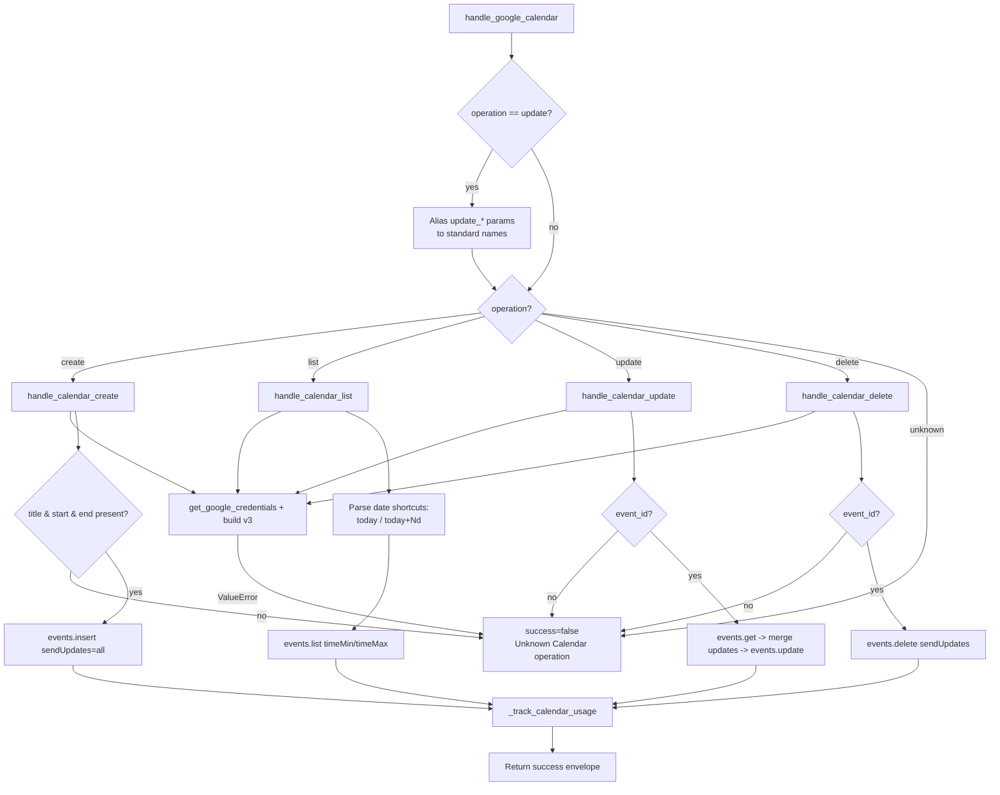

# Calendar (`calendar`)

| Field | Value |
|------|-------|
| **Category** | google_workspace / tool (dual-purpose) |
| **Frontend definition** | [`client/src/nodeDefinitions/googleWorkspaceNodes.ts`](../../../client/src/nodeDefinitions/googleWorkspaceNodes.ts) |
| **Backend handler** | [`server/services/handlers/calendar.py::handle_google_calendar`](../../../server/services/handlers/calendar.py) |
| **Tests** | [`server/tests/nodes/test_google_workspace.py`](../../../server/tests/nodes/test_google_workspace.py) |
| **Skill (if any)** | [`server/skills/productivity_agent/calendar-skill/SKILL.md`](../../../server/skills/productivity_agent/calendar-skill/SKILL.md) |
| **Dual-purpose tool** | yes - tool name `calendar` |

## Purpose

Consolidated Google Calendar node covering create, list, update, delete
operations on calendar events. Uses Google Calendar API v3. One node, four
operations switched via the `operation` parameter.

## Inputs (handles)

| Handle | Connection type | Required | Purpose |
|--------|-----------------|----------|---------|
| `input-main` | main | no | Template source for operation parameters |

## Parameters

Top-level dispatcher: `operation` (one of `create`, `list`, `update`, `delete`).

### `operation = create`

| Name | Type | Default | Required | Description |
|------|------|---------|----------|-------------|
| `title` | string | `""` | **yes** | Event summary |
| `start_time` | string | `""` | **yes** | ISO 8601 datetime |
| `end_time` | string | `""` | **yes** | ISO 8601 datetime |
| `description` | string | `""` | no | Event description |
| `location` | string | `""` | no | Location text |
| `attendees` | string | `""` | no | Comma-separated emails |
| `reminder_minutes` | number | `30` | no | Popup reminder lead time |
| `calendar_id` | string | `primary` | no | Target calendar |
| `timezone` | string | `UTC` | no | Event timezone |

### `operation = list`

| Name | Type | Default | Description |
|------|------|---------|-------------|
| `start_date` | string | today 00:00Z | ISO or `today` |
| `end_date` | string | now+7d | ISO, `today+Nd`, or ISO string |
| `max_results` | number | `10` | Clamped to `min(value, 250)` |
| `calendar_id` | string | `primary` | - |
| `single_events` | boolean | `true` | Expand recurrences |
| `order_by` | options | `startTime` | `startTime` or `updated` |

### `operation = update`

| Name | Type | Default | Required | Description |
|------|------|---------|----------|-------------|
| `event_id` | string | `""` | **yes** | Event to update |
| `title` / `start_time` / `end_time` / `description` / `location` | string | `""` | no | Patch fields |
| `calendar_id` | string | `primary` | no | - |

Also accepts `update_title`, `update_start_time`, etc. which the dispatcher
aliases onto the standard names.

### `operation = delete`

| Name | Type | Default | Required | Description |
|------|------|---------|----------|-------------|
| `event_id` | string | `""` | **yes** | Event to delete |
| `calendar_id` | string | `primary` | no | - |
| `send_updates` | options | `all` | no | `all` or `none` - cancellation emails |

## Outputs (handles)

| Handle | Shape | Description |
|--------|-------|-------------|
| `output-main` | object | Operation-specific payload |
| `output-tool` | object | Same, for AI tool wiring |

- `create` / `update`: `{event_id, title, start, end, html_link, status, created?/updated?}`
- `list`: `{events: [{event_id, title, start, end, description, location, status, html_link, attendees}], count, time_range: {start, end}}`
- `delete`: `{deleted: true, event_id}`

## Logic Flow

## Decision Logic

- **Date shortcut parsing** (list): `start_date` of `today` or empty -> today 00:00 UTC; `end_date` starting with `today+` is `today + Nd`; otherwise the raw string is used and `Z` is appended if missing.
- **Timezone fallback** (update): when updating start/end, the existing event's `timeZone` is reused; if absent falls back to `UTC`.
- **Update parameter aliasing**: the dispatcher copies `update_title`, `update_start_time`, `update_end_time`, `update_description`, `update_location` onto their plain names before delegating - this is irreversible mutation of the incoming `parameters` dict.
- **Description / location**: treated as `is not None` rather than truthy - empty string is a valid clear.
- **Attendees**: empty strings after `split(',')` are filtered; the whole `attendees` field is omitted if the list is empty.
- **`order_by`**: only sent when `single_events=True`; otherwise `None`, which the Google client library strips.

## Side Effects

- **Database writes**: `api_usage_metrics` row per call via `save_api_usage_metric` with `service='google_calendar'`.
- **Broadcasts**: none.
- **External API calls**: Calendar API v3 - `events().insert/list/update/delete/get`. `sendUpdates='all'` on create/update sends email invitations to attendees.
- **File I/O**: none.
- **Subprocess**: none.

## External Dependencies

- **Credentials**: OAuth via `auth_service.get_oauth_tokens("google")`.
- **Services**: Google Calendar API, `PricingService`, `Database`.
- **Python packages**: `google-api-python-client`.
- **Environment variables**: none.

## Edge cases & known limits

- `max_results` clamped to 250 silently.
- `update` performs a read-modify-write cycle: two API calls per update. A concurrent modification between the `get` and `update` is overwritten without ETag checking.
- `delete` with an invalid event_id will surface the `HttpError 404` message into the envelope as a string.
- The dispatcher mutates the incoming `parameters` dict for update aliasing; callers that reuse the dict will see the aliased fields.
- `description=""` is treated as a real clear; `description=None` or missing leaves the field untouched. Subtle but load-bearing for update callers.

## Related

- **Skills using this as a tool**: [`calendar-skill/SKILL.md`](../../../server/skills/productivity_agent/calendar-skill/SKILL.md)
- **Companion nodes**: [`gmail`](./gmail.md), [`drive`](./drive.md), [`sheets`](./sheets.md), [`tasks`](./tasks.md), [`contacts`](./contacts.md)
- **Architecture docs**: `CLAUDE.md` -> "Google Workspace Nodes".
