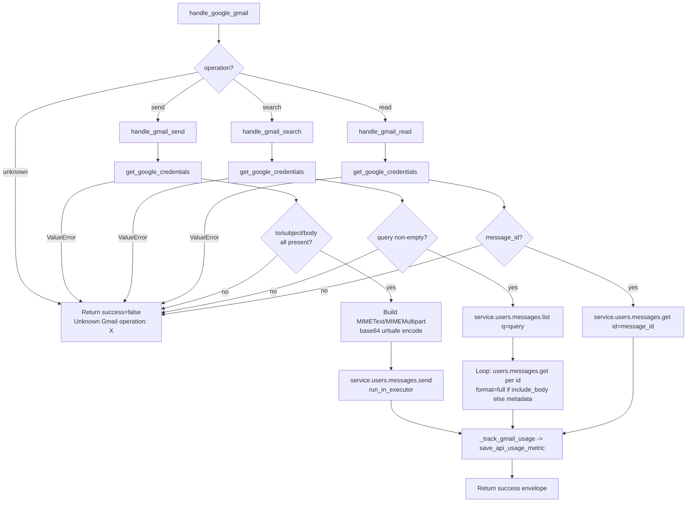

# Gmail (`gmail`)

| Field | Value |
|------|-------|
| **Category** | google_workspace / tool (dual-purpose) |
| **Backend handler** | [`server/services/handlers/gmail.py::handle_google_gmail`](../../../server/services/handlers/gmail.py) |
| **Tests** | [`server/tests/nodes/test_google_workspace.py`](../../../server/tests/nodes/test_google_workspace.py) |
| **Skill (if any)** | [`server/skills/productivity_agent/gmail-skill/SKILL.md`](../../../server/skills/productivity_agent/gmail-skill/SKILL.md) |
| **Dual-purpose tool** | yes - tool name `gmail` |

## Purpose

Consolidated Gmail node covering send, search, and read operations. Uses the
Google Gmail API v1 via the official `google-api-python-client`. One node, three
operations switched via the `operation` parameter. Authenticates through the
shared `get_google_credentials()` helper that reads OAuth tokens stored via
`auth_service.store_oauth_tokens("google", ...)`.

## Inputs (handles)

| Handle | Connection type | Required | Purpose |
|--------|-----------------|----------|---------|
| `input-main` | main | no | Template source for operation parameters |

## Parameters

Top-level dispatcher: `operation` (one of `send`, `search`, `read`).

### `operation = send`

| Name | Type | Default | Required | Description |
|------|------|---------|----------|-------------|
| `to` | string | `""` | **yes** | Recipient email(s), comma-separated |
| `cc` | string | `""` | no | CC recipients |
| `bcc` | string | `""` | no | BCC recipients |
| `subject` | string | `""` | **yes** | Email subject |
| `body` | string | `""` | **yes** | Email body content |
| `body_type` | options | `text` | no | `text` or `html` |

### `operation = search`

| Name | Type | Default | Required | Description |
|------|------|---------|----------|-------------|
| `query` | string | `""` | **yes** | Gmail search query (same syntax as Gmail web) |
| `max_results` | number | `10` | no | Clamped to `min(value, 100)` |
| `include_body` | boolean | `false` | no | If true, fetches `format=full` per message |

### `operation = read`

| Name | Type | Default | Required | Description |
|------|------|---------|----------|-------------|
| `message_id` | string | `""` | **yes** | Gmail message ID |
| `format` | options | `full` | no | `full` / `minimal` / `raw` / `metadata` |

Shared: `account_mode` (default `owner`), `customer_id` (required when
`account_mode == 'customer'`).

## Outputs (handles)

| Handle | Shape | Description |
|--------|-------|-------------|
| `output-main` | object | Operation-specific payload (see below) |
| `output-tool` | object | Same payload, used when wired to an AI agent `input-tools` |

### Output payloads

- `send`: `{message_id, thread_id, label_ids, to, subject}`
- `search`: `{messages: [...], count, query, result_size_estimate}` where each
  message is `{message_id, thread_id, from, to, cc, subject, date, snippet,
  labels, size_estimate, body?, attachments?}`
- `read`: formatted message (same shape as a single entry in `search`)

## Logic Flow

## Decision Logic

- **Operation dispatch**: `if/elif` chain in `handle_google_gmail`. Unknown operation returns an error envelope (does NOT raise).
- **Credential resolution** (`get_google_credentials`): owner mode reads from `auth_service.get_oauth_tokens("google", customer_id="owner")`; customer mode reads from `google_connections` table. Raises `ValueError` if no tokens found.
- **Proactive refresh**: if the Credentials object reports `expired and not valid` and a `refresh_token` is present, a refresh is attempted in a thread executor; result is persisted via `auth_service.store_oauth_tokens`. Refresh failures are swallowed to DEBUG.
- **Search body fetching**: `include_body=False` uses `format=metadata` with a fixed header list (`From`, `To`, `Subject`, `Date`); `True` uses `format=full`. Body extraction recurses into multipart payloads; prefers `text/plain` over `text/html`.
- **Send body type**: `body_type=='html'` -> `MIMEMultipart('alternative')` with an HTML part; otherwise `MIMEText(body, 'plain')`. Message is `urlsafe_b64encode`d to base64.
- **Error paths**: every sub-handler wraps the whole body in `try/except Exception` and returns `{success: false, error: str(e), execution_time: ...}`.

## Side Effects

- **Database writes**: one row per API call in `api_usage_metrics` via `database.save_api_usage_metric` with `service='gmail'`, `operation=<action>`, `endpoint=<action>`, `resource_count`, `cost` (always 0 for Google APIs).
- **Broadcasts**: none from the handler itself; `NodeExecutor` emits standard `node_status`.
- **External API calls**: Gmail API v1 via `googleapiclient.discovery.build("gmail", "v1", creds)` - `users().messages().send/list/get`. Proactive token refresh hits `https://oauth2.googleapis.com/token`.
- **File I/O**: none.
- **Subprocess**: none.

## External Dependencies

- **Credentials**: OAuth tokens via `auth_service.get_oauth_tokens("google", customer_id="owner")`; `google_client_id` / `google_client_secret` via `auth_service.get_api_key(...)`.
- **Services**: Google Gmail API, `PricingService`, `Database`.
- **Python packages**: `google-auth`, `google-auth-oauthlib`, `google-api-python-client`.
- **Environment variables**: none (OAuth redirect URI derived from request at auth time).

## Edge cases & known limits

- `max_results` is silently clamped to 100 (hard ceiling).
- Search fetches every matching message individually in sequence - with `max_results=100` this is 100 round trips. No batching.
- The proactive refresh path swallows exceptions - if the refresh token has been revoked the handler continues and subsequently fails with a 401-shaped error surfaced as `"<status>"` in the envelope.
- `_format_message` returns empty strings for missing headers rather than omitting them; callers should not treat `""` as "header was present and empty".
- `body` is returned as a UTF-8 decoded string with `errors='ignore'` - binary parts may produce partial output without raising.

## Related

- **Skills using this as a tool**: [`gmail-skill/SKILL.md`](../../../server/skills/productivity_agent/gmail-skill/SKILL.md)
- **Companion nodes**: [`gmailReceive`](./gmailReceive.md), [`calendar`](./calendar.md), [`drive`](./drive.md), [`sheets`](./sheets.md), [`tasks`](./tasks.md), [`contacts`](./contacts.md)
- **Architecture docs**: `CLAUDE.md` -> "Google Workspace Nodes" and "Encrypted Credentials System".
