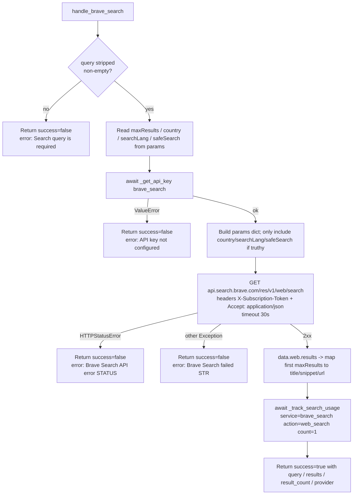

# Brave Search (`braveSearch`)

| Field | Value |
|------|-------|
| **Category** | search / tool (dual-purpose) |
| **Backend handler** | [`server/services/handlers/search.py::handle_brave_search`](../../../server/services/handlers/search.py) |
| **Tests** | [`server/tests/nodes/test_search.py`](../../../server/tests/nodes/test_search.py) |
| **Skill (if any)** | [`server/skills/web_agent/brave-search-skill/SKILL.md`](../../../server/skills/web_agent/brave-search-skill/SKILL.md) |
| **Dual-purpose tool** | yes - tool name `brave_search` |

## Purpose

Free-text web search via the Brave Search REST API. Returns ranked web results
with title, snippet, and URL. Used both as a workflow node (drag onto canvas)
and as an AI agent tool (connect to `input-tools`); when invoked as a tool
the LLM fills the same parameter schema documented below.

## Inputs (handles)

| Handle | Connection type | Required | Purpose |
|--------|-----------------|----------|---------|
| `input-main` | main | no | Upstream data; not consumed directly - all inputs come from `parameters` |

## Parameters

| Name | Type | Default | Required | displayOptions.show | Description |
|------|------|---------|----------|---------------------|-------------|
| `toolName` | string | `brave_search` | no | - | Name of this node when exposed as an AI tool |
| `toolDescription` | string | (see frontend) | no | - | Description shown to LLM in tool schema |
| `query` | string | `""` | **yes** | - | Search query |
| `maxResults` | number | `10` | no | - | 1-100; clamped via `min(maxResults, 100)` before API call |
| `country` | string | `""` | no | - | ISO country code, e.g. `US` - only sent when truthy |
| `searchLang` | string | `""` | no | - | ISO language code, e.g. `en` - only sent when truthy |
| `safeSearch` | options | `moderate` | no | - | One of `off` / `moderate` / `strict` |

## Outputs (handles)

| Handle | Shape | Description |
|--------|-------|-------------|
| `output-main` | object | Standard search payload (see below) |
| `output-tool` | object | Same payload, used when this node is wired to an AI agent's `input-tools` |

### Output payload

```ts
{
  query: string;
  results: Array<{ title: string; snippet: string; url: string }>;
  result_count: number;
  provider: 'brave_search';
}
```

Wrapped in the standard envelope: `{ success: true, result: <payload>, execution_time: number }`.

## Logic Flow



## Decision Logic

- **Empty query**: `query.strip() == ""` -> immediate failure envelope, no API call.
- **Param trimming**: `country`, `searchLang`, `safeSearch` only added to the request when truthy. Note: `safeSearch` defaults to `'moderate'` in the frontend so it is effectively always sent.
- **maxResults clamp**: API receives `min(maxResults, 100)` regardless of the requested value; the response is then sliced to the original `maxResults` again before mapping.
- **Result mapping**: missing fields fall back to empty string (`title`, `snippet`, `url`).

## Side Effects

- **Database writes**: one row in `api_usage_metrics` (via `database.save_api_usage_metric`) with `service='brave_search'`, `operation` from PricingService, `cost` from PricingService, plus `session_id` / `node_id` / `workflow_id`.
- **Broadcasts**: none.
- **External API calls**: `GET https://api.search.brave.com/res/v1/web/search` (timeout 30s).
- **File I/O**: none.
- **Subprocess**: none.

## External Dependencies

- **Credentials**: `auth_service.get_api_key('brave_search')` - looked up at execution time; stored under `EncryptedAPIKey` table.
- **Services**: `PricingService` for cost calc, `Database` for usage row.
- **Python packages**: `httpx`.
- **Environment variables**: none.

## Edge cases & known limits

- API hard-caps `count` at 100; values above 100 are silently capped.
- Network errors are caught by the generic `Exception` handler and returned as `Brave Search failed: <str>` - i.e. the handler never raises; downstream nodes always see an envelope.
- The handler does *not* validate `safeSearch` values - the API rejects unknown values with 4xx, which becomes the `Brave Search API error: 400` envelope.

## Related

- **Skills using this as a tool**: [`brave-search-skill/SKILL.md`](../../../server/skills/web_agent/brave-search-skill/SKILL.md)
- **Companion nodes**: [`serperSearch`](./serperSearch.md), [`perplexitySearch`](./perplexitySearch.md), [`duckduckgoSearch`](../tools/duckduckgoSearch.md)
- **Architecture docs**: [Pricing Service](../../pricing_service.md), [Credentials Encryption](../../credentials_encryption.md)
