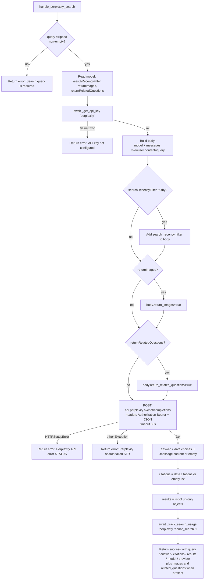

# Perplexity Search (`perplexitySearch`)

| Field | Value |
|------|-------|
| **Category** | search / tool (dual-purpose) |
| **Frontend definition** | [`client/src/nodeDefinitions/searchNodes.ts`](../../../client/src/nodeDefinitions/searchNodes.ts) |
| **Backend handler** | [`server/services/handlers/search.py::handle_perplexity_search`](../../../server/services/handlers/search.py) |
| **Tests** | [`server/tests/nodes/test_search.py`](../../../server/tests/nodes/test_search.py) |
| **Skill (if any)** | [`server/skills/web_agent/perplexity-search-skill/SKILL.md`](../../../server/skills/web_agent/perplexity-search-skill/SKILL.md) |
| **Dual-purpose tool** | yes - tool name `perplexity_search` |

## Purpose

AI-generated answer with inline citations from Perplexity Sonar models. The
node returns an LLM completion *plus* the citation URLs Perplexity used so
downstream nodes can render references or follow the sources.

## Inputs (handles)

| Handle | Connection type | Required | Purpose |
|--------|-----------------|----------|---------|
| `input-main` | main | no | Upstream data; not consumed directly |

## Parameters

| Name | Type | Default | Required | displayOptions.show | Description |
|------|------|---------|----------|---------------------|-------------|
| `toolName` | string | `perplexity_search` | no | - | Tool name when exposed to AI |
| `toolDescription` | string | (see frontend) | no | - | Tool description for AI |
| `query` | string | `""` | **yes** | - | Question for the model |
| `model` | options | `sonar` | no | - | One of `sonar` / `sonar-pro` / `sonar-reasoning` / `sonar-reasoning-pro` |
| `searchRecencyFilter` | options | `""` | no | - | One of `""` / `month` / `week` / `day` / `hour` |
| `returnImages` | boolean | `false` | no | - | When true, include images array in payload |
| `returnRelatedQuestions` | boolean | `false` | no | - | When true, include related_questions array |

## Outputs (handles)

| Handle | Shape | Description |
|--------|-------|-------------|
| `output-main` | object | Answer + citations payload |
| `output-tool` | object | Same payload, AI-tool wiring |

### Output payload

```ts
{
  query: string;
  answer: string;                       // markdown content from choices[0].message.content
  citations: string[];                  // URLs the model cited
  results: Array<{ url: string }>;      // citations remapped as result objects
  model: string;                        // echoes the model param
  provider: 'perplexity';
  images?: string[];                    // present only if requested AND returned
  related_questions?: string[];         // present only if requested AND returned
}
```

Wrapped in the standard envelope.

## Logic Flow



## Decision Logic

- **Empty query**: short-circuit failure envelope.
- **Optional body fields** (`search_recency_filter`, `return_images`, `return_related_questions`) only added when the corresponding param is truthy. `searchRecencyFilter=''` is the explicit "off" value.
- **Empty `choices`**: `answer` falls back to `''` rather than raising.
- **Optional response fields** (`images`, `related_questions`) only added to the output payload when present *and non-empty* (`if images:` / `if related_questions:`).

## Side Effects

- **Database writes**: one `api_usage_metrics` row per call (`service='perplexity'`, `operation='sonar_search'`).
- **Broadcasts**: none.
- **External API calls**: `POST https://api.perplexity.ai/chat/completions` (timeout 60s - longer than the other search nodes because Sonar Reasoning models can be slow).
- **File I/O**: none.
- **Subprocess**: none.

## External Dependencies

- **Credentials**: `auth_service.get_api_key('perplexity')`.
- **Services**: `PricingService`, `Database`.
- **Python packages**: `httpx`.

## Edge cases & known limits

- 60s timeout - reasoning-pro models can occasionally exceed this and surface as `Perplexity search failed: ReadTimeout`.
- Citations field shape can vary across Perplexity response versions (`list[str]` historically). The handler assumes `list[str]`; a list-of-objects response will pass through to the output unchanged but break the `results` mapping (`{'url': <obj>}`).
- The `results` list is purely a citations remap; downstream nodes expecting `title` / `snippet` will not find them - use `braveSearch` or `serperSearch` for those.

## Related

- **Skills using this as a tool**: [`perplexity-search-skill/SKILL.md`](../../../server/skills/web_agent/perplexity-search-skill/SKILL.md)
- **Companion nodes**: [`braveSearch`](./braveSearch.md), [`serperSearch`](./serperSearch.md)
- **Architecture docs**: [Pricing Service](../../pricing_service.md)
