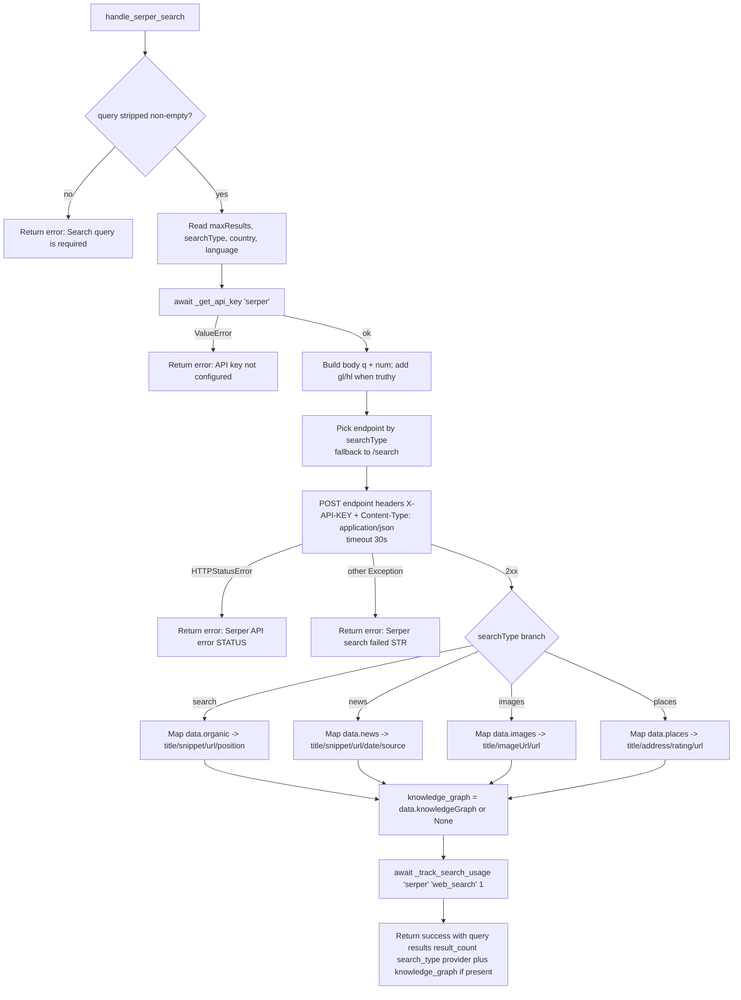

# Serper Search (`serperSearch`)

| Field | Value |
|------|-------|
| **Category** | search / tool (dual-purpose) |
| **Backend handler** | [`server/services/handlers/search.py::handle_serper_search`](../../../server/services/handlers/search.py) |
| **Tests** | [`server/tests/nodes/test_search.py`](../../../server/tests/nodes/test_search.py) |
| **Skill (if any)** | [`server/skills/web_agent/serper-search-skill/SKILL.md`](../../../server/skills/web_agent/serper-search-skill/SKILL.md) |
| **Dual-purpose tool** | yes - tool name `serper_search` |

## Purpose

Google SERP scraping via the Serper API. Supports four search verticals
(web, news, images, places) and optional knowledge-graph enrichment for the
default web search. Used as a workflow node and as an AI agent tool.

## Inputs (handles)

| Handle | Connection type | Required | Purpose |
|--------|-----------------|----------|---------|
| `input-main` | main | no | Upstream data; not consumed directly |

## Parameters

| Name | Type | Default | Required | displayOptions.show | Description |
|------|------|---------|----------|---------------------|-------------|
| `toolName` | string | `serper_search` | no | - | Tool name when exposed to AI |
| `toolDescription` | string | (see frontend) | no | - | Tool description for AI |
| `query` | string | `""` | **yes** | - | Search query |
| `searchType` | options | `search` | no | - | One of `search` / `news` / `images` / `places` |
| `maxResults` | number | `10` | no | - | 1-100; clamped via `min(maxResults, 100)` before API call |
| `country` | string | `""` | no | - | Sent as `gl` only when truthy |
| `language` | string | `""` | no | - | Sent as `hl` only when truthy |

## Outputs (handles)

| Handle | Shape | Description |
|--------|-------|-------------|
| `output-main` | object | Search payload (shape varies by `searchType`) |
| `output-tool` | object | Same payload, AI-tool wiring |

### Output payload

```ts
{
  query: string;
  results: Array<SearchResult | NewsResult | ImageResult | PlaceResult>;
  result_count: number;
  search_type: 'search' | 'news' | 'images' | 'places';
  provider: 'serper';
  knowledge_graph?: object;  // only when API returns it
}

type SearchResult = { title: string; snippet: string; url: string; position?: number };
type NewsResult   = { title: string; snippet: string; url: string; date: string; source: string };
type ImageResult  = { title: string; imageUrl: string; url: string };
type PlaceResult  = { title: string; address: string; rating?: number; url: string };
```

Wrapped in the standard envelope.

## Logic Flow



## Decision Logic

- **Empty query**: short-circuit failure envelope.
- **searchType dispatch**: hard-coded `endpoint_map`; unknown values fall through to `https://google.serper.dev/search` *and* take the `if search_type == 'search'` branch... wait no - they hit the default endpoint but skip every branch in the result loop, returning `results: []`. Document this as a known gotcha.
- **knowledge_graph**: only added to the payload when the API includes a non-falsy `knowledgeGraph` field.
- **maxResults clamp**: API receives `min(maxResults, 100)`; results list is then sliced again to `maxResults`.
- **gl/hl trimming**: `country` -> `gl`, `language` -> `hl`. Only sent when truthy.

## Side Effects

- **Database writes**: one `api_usage_metrics` row per call (`service='serper'`, `operation` from PricingService).
- **Broadcasts**: none.
- **External API calls**: `POST` to one of `https://google.serper.dev/{search,news,images,places}` (timeout 30s).
- **File I/O**: none.
- **Subprocess**: none.

## External Dependencies

- **Credentials**: `auth_service.get_api_key('serper')`.
- **Services**: `PricingService`, `Database`.
- **Python packages**: `httpx`.

## Edge cases & known limits

- An unrecognised `searchType` value silently returns `results: []` (no error). Refactors must preserve this or update the test to assert the new behaviour.
- 4xx/5xx API errors are translated into `Serper API error: <status>` - the response body is logged but not exposed.
- The handler trusts the API to return the expected nested keys (`organic`, `news`, etc.); a malformed response yields an empty results list rather than an exception.

## Related

- **Skills using this as a tool**: [`serper-search-skill/SKILL.md`](../../../server/skills/web_agent/serper-search-skill/SKILL.md)
- **Companion nodes**: [`braveSearch`](./braveSearch.md), [`perplexitySearch`](./perplexitySearch.md)
- **Architecture docs**: [Pricing Service](../../pricing_service.md)
