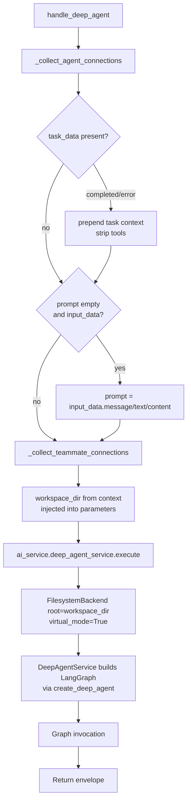

# Deep Agent (`deep_agent`)

| Field | Value |
|------|-------|
| **Category** | specialized_agents |
| **Frontend definition** | [`client/src/nodeDefinitions/specializedAgentNodes.ts`](../../../client/src/nodeDefinitions/specializedAgentNodes.ts) (search `deep_agent`) |
| **Backend handler** | [`server/services/handlers/deep_agent.py::handle_deep_agent`](../../../server/services/handlers/deep_agent.py) |
| **Backend service** | [`server/services/agents/service.py::DeepAgentService.execute`](../../../server/services/agents/service.py) |
| **Theme color** | `dracula.green` |
| **Icon** | brain (U+1F9E0) |
| **Team lead** | yes -- teammates become deepagents `SubAgent` dicts |
| **Tests** | [`server/tests/nodes/test_specialized_agents.py::TestDeepAgent`](../../../server/tests/nodes/test_specialized_agents.py) |

## Purpose

AI agent backed by LangChain [DeepAgents](https://github.com/langchain-ai/deepagents)
rather than the stock LangGraph loop. Provides built-in filesystem tools
(read, write, edit, glob, grep, execute), sub-agent delegation,
auto-summarization, and todo planning, all operating on a sandboxed
per-workflow workspace (`data/workspaces/<workflow_id>/`).

## Inputs (handles)

Same 5 shared handles as the generic specialized agents plus an
`input-teammates` handle used to seed deepagents sub-agents.

| Handle | Purpose |
|--------|---------|
| `input-main` | Auto-prompt fallback |
| `input-skill` | Skill instructions merged into system prompt |
| `input-memory` | `simpleMemory` conversation history |
| `input-tools` | Tools exposed to the deep-agent graph |
| `input-task` | `taskTrigger` completion events |
| `input-teammates` | Teammate agents converted to `SubAgent` dicts |

## Parameters

Standard `AI_AGENT_PROPERTIES` plus deepagents-specific options read by
`DeepAgentService` (`recursionLimit`, etc.).

## Outputs (handles)

| Handle | Shape | Description |
|--------|-------|-------------|
| `output-main` | object | Standard agent envelope with `response`, `model`, `provider` |

## Logic Flow

## Decision Logic

- **Same connection-collection short-circuits** as `handle_chat_agent`:
  task completion strips tools; empty prompt falls back to upstream
  message/text/content.
- **Workspace injection**: `context['workspace_dir']` is copied into
  `parameters['workspace_dir']` so `DeepAgentService` can pass it to
  `FilesystemBackend(root_dir=workspace_dir, virtual_mode=True)`.
- **Teammates become deepagents sub-agents**: passed as a list to
  `service.execute(..., teammates=teammates)`; the service constructs
  deepagents `SubAgent` dicts and injects them into
  `create_deep_agent(subagents=...)`.
- **Tool building**: the handler passes `build_tool_fn=ai_service._build_tool_from_node`
  so the service layer can convert raw `tool_data` into LangChain
  `StructuredTool` instances inside the deepagents graph.

## Side Effects

- **Database reads**: `database.get_node_parameters(source_id)` for every
  connected skill, memory, tool, and teammate node.
- **Database writes**: token usage and compaction rows via
  `DeepAgentService` -> `AIService` helpers.
- **Broadcasts**: `StatusBroadcaster.update_node_status` (executing,
  success, error), plus `executing_tool` for tools invoked during the
  deepagents run.
- **File I/O**: reads and writes within `data/workspaces/<workflow_id>/`
  via the sandboxed `FilesystemBackend`.
- **External API calls**: LLM provider calls inside the deepagents graph
  (one per planning / tool / summarization step).

## External Dependencies

- **Credentials**: `auth_service.get_api_key(<provider>)`.
- **Services**: `DeepAgentService`, `StatusBroadcaster`,
  `PricingService`, `CompactionService`, `FilesystemBackend`.
- **Python packages**: `deepagents`, `langchain-core`, `langgraph`,
  provider SDKs.
- **Filesystem**: writable `data/workspaces/<workflow_id>/` directory.

## Edge cases & known limits

- **Missing workspace**: if `context['workspace_dir']` is absent
  (`None`), no injection happens; `DeepAgentService` falls back to
  `Settings().workspace_base_dir`. The handler logs `workspace_dir from
  context: None` at INFO but does not short-circuit.
- **Missing `deepagents` package**: `DeepAgentService.execute` raises an
  `ImportError` which the handler's surrounding `NodeExecutor.execute`
  wrapper converts into a failure envelope. There is no explicit
  preflight check in the handler itself.
- **Teammate filtering**: uses `_collect_teammate_connections` which
  filters to `AI_AGENT_TYPES`; non-agent nodes on `input-teammates` are
  silently skipped.
- **No task-context tool rename**: unlike `handle_chat_agent` where the
  stripped tools are replaced by delegate_to_* tools for team leads, the
  deep_agent task-completion branch strips all tools outright. A
  subsequent user turn must re-trigger a fresh execution to restore them.

## Related

- **Pattern siblings**: [`rlmAgent`](./rlmAgent.md), [`claudeCodeAgent`](./claudeCodeAgent.md)
- **Generic pattern**: [`_pattern.md`](./_pattern.md) (for the shared
  `_collect_agent_connections` helper)
- **Architecture**: [Deep Agent](../../deep_agent.md)
