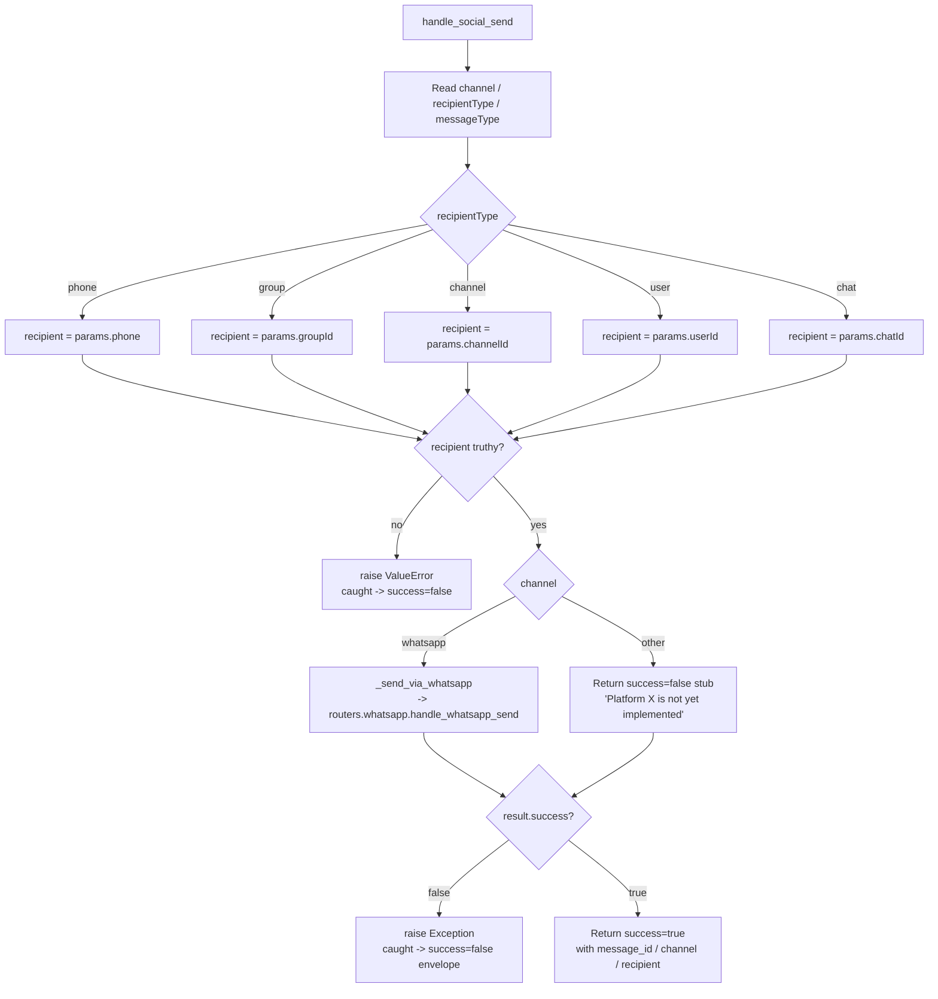

# Social Send (`socialSend`)

| Field | Value |
|------|-------|
| **Category** | social / tool (dual-purpose) |
| **Frontend definition** | [`client/src/nodeDefinitions/socialNodes.ts`](../../../client/src/nodeDefinitions/socialNodes.ts) |
| **Backend handler** | [`server/services/handlers/social.py::handle_social_send`](../../../server/services/handlers/social.py) |
| **Tests** | [`server/tests/nodes/test_telegram_social.py`](../../../server/tests/nodes/test_telegram_social.py) |
| **Skill (if any)** | none |
| **Dual-purpose tool** | yes - works as a workflow node and as an AI Agent tool |

## Purpose

Platform-agnostic outbound messaging. Routes the payload to the platform
identified by `channel` - currently only `whatsapp` is implemented; every
other value (`telegram`, `discord`, `slack`, `signal`, `sms`, `webchat`,
`email`, `matrix`, `teams`) falls through to an "not yet implemented" stub
and surfaces as a failed envelope.

## Inputs (handles)

| Handle | Connection type | Required | Purpose |
|--------|-----------------|----------|---------|
| `input-main` | main | no | Upstream data; consumed only via template resolution on individual params (e.g. `message`) |

## Parameters

| Name | Type | Default | Required | displayOptions.show | Description |
|------|------|---------|----------|---------------------|-------------|
| `channel` | options | `whatsapp` | no | - | Destination platform - only `whatsapp` is wired today |
| `recipientType` | options | `phone` | no | - | `phone` / `group` / `channel` / `user` / `chat` |
| `phone` | string | `""` | yes when `recipientType=phone` | `recipientType: ['phone']` | Destination phone (WhatsApp style incl. country code) |
| `groupId` | string | `""` | yes when `recipientType=group` | `recipientType: ['group']` | Group JID |
| `channelId` | string | `""` | yes when `recipientType=channel` | `recipientType: ['channel']` | Newsletter/channel JID |
| `userId` | string | `""` | yes when `recipientType=user` | `recipientType: ['user']` | Platform user id |
| `chatId` | string | `""` | yes when `recipientType=chat` | `recipientType: ['chat']` | Generic chat id |
| `messageType` | options | `text` | no | - | `text`/`image`/`video`/`audio`/`document`/`sticker`/`location`/`contact`/`poll`/`buttons`/`list` |
| `message` | string | `""` | yes when `messageType=text` | `messageType: ['text']` | Message body |
| `mediaSource` | options | `url` | no | `messageType: ['image','video','audio','document','sticker']` | One of `url`/`base64`/`file` |
| `mediaUrl` / `mediaData` / `filePath` | string | `""` | depends on `mediaSource` | (see above) | Media payload |
| `mimeType`, `caption`, `filename` | string | `""` | no | media types | Extra media fields |
| `latitude`, `longitude`, `locationName`, `address` | mixed | - | yes for location | `messageType: ['location']` | Location fields |
| `contactName`, `vcard` | string | `""` | yes for contact | `messageType: ['contact']` | vCard fields |
| `replyToMessage` | boolean | `false` | no | - | Send as reply |
| `replyMessageId` | string | `""` | yes when `replyToMessage=true` | - | Message id to reply to |

## Outputs (handles)

| Handle | Shape | Description |
|--------|-------|-------------|
| `output-main` | object | Send result envelope |
| `output-tool` | object | Same payload, emitted when wired to an AI agent's `input-tools` |

### Output payload

```ts
{
  success: true;
  message_id: string | null;
  channel: string;         // e.g. 'whatsapp'
  recipient: string;       // resolved phone / groupId / channelId / userId / chatId
  recipient_type: string;
  message_type: string;
  timestamp: string;       // ISO
}
```

Wrapped in the standard envelope `{ success, node_id, node_type, result, execution_time, timestamp }`.

## Logic Flow



## Decision Logic

- **Recipient resolution**: Hard-coded mapping from `recipientType` to a
  specific parameter key. An unknown `recipientType` leaves `recipient = None`
  and the handler raises `ValueError("Recipient (<type>) is required")`.
- **Channel dispatch**: Python `if/elif` on `channel`. Only `"whatsapp"` is
  wired. Every other value returns
  `{"success": False, "error": "Platform '<x>' is not yet implemented"}`
  which is then re-raised as a generic `Exception` and becomes the envelope's
  `error` string.
- **Message type branching**: `_send_via_whatsapp` converts the social-send
  parameter shape into the whatsapp-send shape (camelCase -> snake_case,
  media sources, reply flags). Unknown `messageType` values fall through
  without setting any media/content fields - the downstream WhatsApp handler
  is responsible for rejecting them.
- **Reply handling**: Only set when `replyToMessage` is truthy; sets
  `is_reply=True` and copies `replyMessageId -> reply_message_id`.

## Side Effects

- **Database writes**: none directly. The WhatsApp handler this delegates
  to may record usage.
- **Broadcasts**: none from `handle_social_send` itself; broadcasts originate
  in the underlying platform handler.
- **External API calls**: delegated to `routers.whatsapp.handle_whatsapp_send`
  for the `whatsapp` channel, which hits the WhatsApp RPC service
  (default `http://localhost:9400`).
- **File I/O**: none from this handler. `mediaSource=file` reads are delegated.
- **Subprocess**: none.

## External Dependencies

- **Credentials**: none at this layer - the WhatsApp handler manages its own
  RPC connection.
- **Services**: `routers.whatsapp.handle_whatsapp_send` (imported lazily
  inside `_send_via_whatsapp`).
- **Python packages**: stdlib only (`time`, `datetime`, `typing`).
- **Environment variables**: none.

## Edge cases & known limits

- **Only WhatsApp is implemented**: The node advertises 10 channels but silently
  degrades to `"Platform '<x>' is not yet implemented"` for the other 9.
- **Lossy exception surface**: A failed WhatsApp call returns
  `{"success": False, "error": "..."}`, which the outer code re-raises as a
  generic `Exception(result.get('error', 'Send failed'))`. The traceback is
  swallowed; only the string survives.
- **Recipient defaults**: When `recipientType` is something the code does not
  handle, `recipient` stays `None` and the ValueError message reports the
  received `recipient_type` string back to the user. Good for debugging, bad
  for LLM tool use (the LLM then retries with a different type).
- **`groupId` used for non-phone `recipient_type`**: Inside `_send_via_whatsapp`,
  anything that is not `phone` maps onto `group_id` in the WhatsApp params,
  including `channel`/`user`/`chat`. This means channels/users/chats end up
  being sent as WhatsApp groups, which the RPC will likely reject.
- **camelCase vs snake_case drift**: Node parameters are mostly camelCase
  (`recipientType`, `messageType`, `mediaUrl`) while the WhatsApp handler
  expects snake_case; the conversion in `_send_via_whatsapp` is manual and
  easy to drift from new parameters added on either side.

## Related

- **Sibling nodes**: [`socialReceive`](./socialReceive.md), [`telegramSend`](./telegramSend.md)
- **Downstream handler**: `routers.whatsapp.handle_whatsapp_send`
- **Architecture docs**: WhatsApp Integration section in the root [`CLAUDE.md`](../../../CLAUDE.md)
