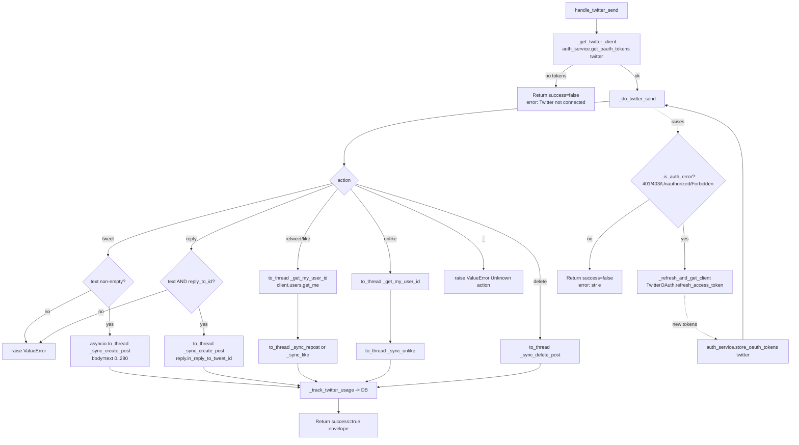

# Twitter Send (`twitterSend`)

| Field | Value |
|------|-------|
| **Category** | social / tool (dual-purpose) |
| **Frontend definition** | [`client/src/nodeDefinitions/twitterNodes.ts`](../../../client/src/nodeDefinitions/twitterNodes.ts) |
| **Backend handler** | [`server/services/handlers/twitter.py::handle_twitter_send`](../../../server/services/handlers/twitter.py) |
| **Tests** | [`server/tests/nodes/test_twitter.py`](../../../server/tests/nodes/test_twitter.py) |
| **Skill (if any)** | [`server/skills/social_agent/twitter-send-skill/SKILL.md`](../../../server/skills/social_agent/twitter-send-skill/SKILL.md) |
| **Dual-purpose tool** | yes - tool name `twitter_send` |

## Purpose

Perform write actions against the authenticated user's Twitter/X account via the
official `xdk` Python SDK. Supports creating an original tweet, replying, native
retweeting, liking, unliking, and deleting. Runs both as a workflow node and as
an AI agent tool when connected to `input-tools`.

All SDK calls are synchronous (`requests`-based) inside the XDK; the handler
wraps every call in `asyncio.to_thread(...)` so the event loop is never blocked.

## Inputs (handles)

| Handle | Connection type | Required | Purpose |
|--------|-----------------|----------|---------|
| `input-main` | main | no | Upstream data; not consumed directly - all inputs come from `parameters` |

## Parameters

| Name | Type | Default | Required | displayOptions.show | Description |
|------|------|---------|----------|---------------------|-------------|
| `action` | options | `tweet` | yes | - | One of `tweet` / `reply` / `retweet` / `quote` / `like` / `unlike` / `delete`. Backend only implements `tweet`, `reply`, `retweet`, `like`, `unlike`, `delete`; `quote` falls through to the `Unknown action` branch. |
| `text` | string | `""` | yes (tweet/reply/quote) | `action: ['tweet','reply','quote']` | Tweet content. Handler truncates to 280 chars via slice. |
| `tweet_id` | string | `""` | yes (reply/retweet/quote/like/unlike/delete) | `action: ['reply','retweet','quote','like','unlike','delete']` | Target tweet ID. |
| `reply_to_id` | string | `""` | yes (reply) | - | ID of the tweet being replied to. Passed in `reply.in_reply_to_tweet_id`. Note the parameter name mismatch vs. frontend `tweet_id` for other actions. |
| `include_media`, `media_urls` | boolean/string | - | no | tweet/reply/quote | **Accepted by frontend but ignored by backend** - the handler never attaches media. |
| `include_poll`, `poll_options`, `poll_duration` | bool/string/number | - | no | tweet | **Accepted by frontend but ignored by backend.** |

## Outputs (handles)

| Handle | Shape | Description |
|--------|-------|-------------|
| `output-main` | object | Standard envelope with XDK response payload |
| `output-tool` | object | Same payload when invoked via `input-tools` |

### Output payload

Handler wraps the XDK response via `_format_response` then via `_success`:

```ts
// On success (tweet/reply):
{
  success: true,
  result: {
    id: string;        // new tweet id
    text: string;
    // ...any additional fields returned by POST /2/tweets (edit_history_tweet_ids, etc.)
  },
  execution_time: number
}
// On success (retweet/like): { retweeted: boolean } or { liked: boolean }
// On success (unlike): { liked: false }
// On success (delete): { deleted: boolean }
// On error: { success: false, error: string, execution_time: number }
```

## Logic Flow



## Decision Logic

- **Client acquisition**: `_get_twitter_client()` reads OAuth tokens via
  `auth_service.get_oauth_tokens("twitter", customer_id="owner")`. Raises
  `ValueError("Twitter not connected. Please authenticate via Credentials.")`
  when tokens are missing.
- **No eager validation**: Handler never calls `get_me()` up-front to verify the
  token; it jumps straight into the action call to conserve rate limits.
- **Lazy refresh**: Any exception bubbling out of `_do_twitter_send` is inspected
  by `_is_auth_error` (substring match on `401`, `403`, `Unauthorized`,
  `Forbidden`). On match, a new client is built via `_refresh_and_get_client()`
  which calls `TwitterOAuth.refresh_access_token`, re-stores tokens via
  `store_oauth_tokens`, and the action is retried once. Non-auth errors surface
  as an error envelope.
- **Validation**:
  - `tweet`: requires non-empty `text`, sliced to 280 chars.
  - `reply`: requires both `text` and `reply_to_id`.
  - `retweet`/`like`/`unlike`/`delete`: require `tweet_id`.
- **User id fetch**: `retweet`/`like`/`unlike` need the authenticated user id;
  `_get_my_user_id` calls `client.users.get_me()` via `asyncio.to_thread`.
- **Unknown action**: `quote` (present in frontend) and any other value fall
  into the default match arm and raise `ValueError(f"Unknown action: {action}")`
  which is converted to an error envelope.

## Side Effects

- **Database writes**: one row per successful action in `api_usage_metrics` via
  `database.save_api_usage_metric(...)` with `service='twitter'` and
  `operation` from `PricingService.calculate_api_cost`. Action -> op name:
  `tweet`, `reply`, `retweet`, `like`, `unlike`, `delete`.
- **Broadcasts**: none from the handler.
- **External API calls**:
  - `POST https://api.twitter.com/2/tweets` (tweet, reply)
  - `POST https://api.twitter.com/2/users/{id}/retweets` (retweet)
  - `POST https://api.twitter.com/2/users/{id}/likes` (like)
  - `DELETE https://api.twitter.com/2/users/{id}/likes/{tweet_id}` (unlike)
  - `DELETE https://api.twitter.com/2/tweets/{id}` (delete)
  - `GET https://api.twitter.com/2/users/me` (implicit, on retweet/like/unlike)
  - `POST https://api.twitter.com/2/oauth2/token` (refresh path, via
    `TwitterOAuth`).
- **File I/O**: none.
- **Subprocess**: none.
- **Token store writes**: on refresh, `auth_service.store_oauth_tokens("twitter", ...)`
  updates the encrypted OAuth credentials row.

## External Dependencies

- **Credentials**: OAuth access + refresh token via
  `auth_service.get_oauth_tokens("twitter", customer_id="owner")`. Stored via
  System 1 (`EncryptedOAuthToken` table); NOT via `get_api_key("twitter_access_token")`.
  Client id + secret are stored via `get_api_key("twitter_client_id")` /
  `get_api_key("twitter_client_secret")` and only consulted on refresh.
- **Services**: `TwitterOAuth` (`server/services/twitter_oauth.py`) for token
  refresh. `PricingService` for cost calculation. `Database` for metric row.
- **Python packages**: `xdk` (X SDK), `httpx` (used transitively inside
  `TwitterOAuth`).
- **Environment variables**: none at runtime (OAuth flow uses stored creds).

## Edge cases & known limits

- **`quote` action is broken**: frontend exposes `Quote Tweet` but backend has no
  handler branch; it falls through to the default arm and surfaces as
  `Unknown action: quote`.
- **Media and polls ignored**: the `include_media` / `include_poll` /
  `media_urls` / `poll_options` / `poll_duration` parameters are never read by
  the handler - the node silently sends a text-only tweet.
- **280-char silent truncation**: `text[:280]` is applied without warning; the
  emitted tweet may be shorter than the user typed.
- **Single retry on auth error**: refresh + retry happens at most once; a
  second 401 surfaces as an error envelope.
- **Refresh failure message**: If `refresh_access_token` fails, the user sees
  `Twitter token expired and refresh failed. Please re-authenticate.` - the
  original upstream error message is lost.
- **`_is_auth_error` uses substring matching**: any error whose `str(e)`
  contains `401`, `403`, `Unauthorized`, or `Forbidden` triggers the refresh
  path, even if the real cause is something else (e.g. a log message quoting
  those strings).
- **Usage tracking only on success**: the `_track_twitter_usage` call happens
  after the SDK call returns; raised errors skip tracking entirely.

## Related

- **Skills using this as a tool**: [`twitter-send-skill/SKILL.md`](../../../server/skills/social_agent/twitter-send-skill/SKILL.md)
- **Sibling nodes**: [`twitterSearch`](./twitterSearch.md), [`twitterUser`](./twitterUser.md), [`twitterReceive`](./twitterReceive.md)
- **Architecture docs**: [Pricing Service](../../pricing_service.md), [Credentials Encryption](../../credentials_encryption.md)
