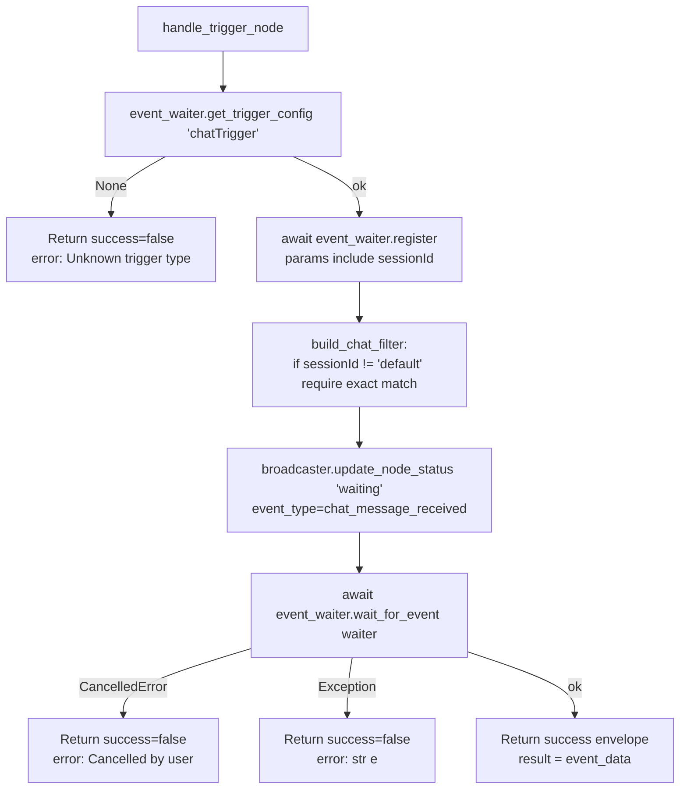

# Chat Trigger (`chatTrigger`)

| Field | Value |
|------|-------|
| **Category** | workflow / trigger / utility |
| **Backend handler** | [`server/services/handlers/triggers.py::handle_trigger_node`](../../../server/services/handlers/triggers.py) (generic) |
| **Tests** | [`server/tests/nodes/test_workflow_triggers.py`](../../../server/tests/nodes/test_workflow_triggers.py) |
| **Skill (if any)** | none |
| **Dual-purpose tool** | no |

## Purpose

Fires when the user sends a message from the Console Panel chat tab. The
WebSocket handler `send_chat_message` calls
`broadcaster.send_custom_event('chat_message_received', {...})` (or the
event-waiter dispatch path) and any `chatTrigger` node whose `sessionId`
matches (or is `'default'`) receives the event and emits it as output. This
is the primary way a user feeds an interactive prompt into an `aiAgent` or
`chatAgent`.

## Inputs (handles)

| Handle | Connection type | Required | Purpose |
|--------|-----------------|----------|---------|
| (none) | - | - | Trigger nodes have no inputs. |

## Parameters

| Name | Type | Default | Required | displayOptions.show | Description |
|------|------|---------|----------|---------------------|-------------|
| `sessionId` | string | `default` | no | - | Matches the `session_id` on the incoming chat event. If set to `default`, the filter accepts every event. Otherwise it only accepts events with the same `session_id`. |
| `placeholder` | string | `Type a message...` | no | - | Frontend display only - not used by the handler. |

## Outputs (handles)

| Handle | Shape | Description |
|--------|-------|-------------|
| `output-main` | object | The chat event payload (see below). |

### Output payload

The exact shape depends on how the dispatcher in
`routers/websocket.py::send_chat_message` builds the event, but the
documented fields surfaced to downstream nodes are:

```ts
{
  message: string;
  timestamp: string;   // ISO 8601
  session_id: string;
  node_id?: string;    // Optional - set when the client targets a specific chatTrigger
}
```

Wrapped in the standard envelope.

## Logic Flow



## Decision Logic

- **Filter** (`build_chat_filter` in `triggers.py`):
  ```python
  if session_id != 'default' and event_session != session_id:
      return False
  return True
  ```
  So `sessionId='default'` (the frontend default) is a wildcard - the
  trigger fires for every chat message regardless of which session the user
  is in.
- **Cancellation**: yields `success=False, error="Cancelled by user"`.

## Side Effects

- **Database writes**: none in the trigger handler itself. (The chat message
  is separately persisted by `send_chat_message` via `database.add_chat_message`.)
- **Broadcasts**: `update_node_status(node_id, "waiting", {message, event_type, waiter_id}, workflow_id)`.
- **External API calls**: none.
- **File I/O**: none.
- **Subprocess**: none.

## External Dependencies

- **Credentials**: none.
- **Services**: `services.event_waiter`, `services.status_broadcaster`.
- **Python packages**: stdlib only.
- **Environment variables**: none.

## Edge cases & known limits

- `sessionId='default'` behaves as a wildcard; setting a unique session ID
  per trigger is the only way to scope messages to a specific node.
- When multiple `chatTrigger` nodes exist with the same session ID, all of
  them fire for a matching message.
- The handler has no timeout; it waits forever until an event arrives or
  the run is cancelled.
- The chat message's persistence to the DB happens in the WebSocket handler
  BEFORE the event is dispatched, so even if no `chatTrigger` is waiting
  the message is still stored in `chat_messages`.

## Related

- **Skills using this as a tool**: none.
- **Sibling triggers**: [`webhookTrigger`](./webhookTrigger.md),
  [`taskTrigger`](./taskTrigger.md).
- **Architecture docs**: [Event Waiter System](../../event_waiter_system.md),
  [Status Broadcaster](../../status_broadcaster.md)
