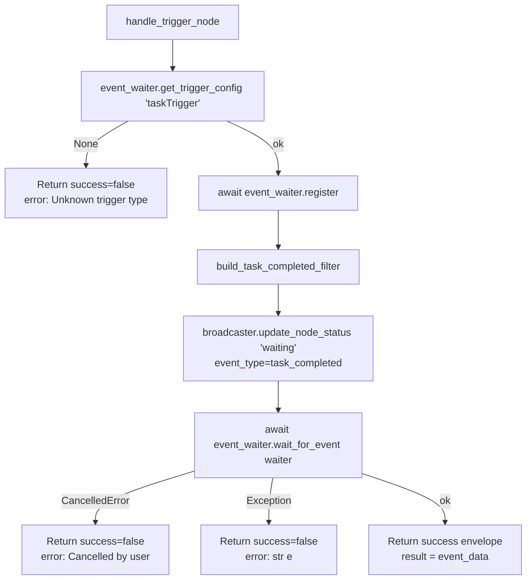

# Task Trigger (`taskTrigger`)

| Field | Value |
|------|-------|
| **Category** | workflow / trigger |
| **Frontend definition** | [`client/src/nodeDefinitions/workflowNodes.ts`](../../../client/src/nodeDefinitions/workflowNodes.ts) |
| **Backend handler** | [`server/services/handlers/triggers.py::handle_trigger_node`](../../../server/services/handlers/triggers.py) (generic) |
| **Tests** | [`server/tests/nodes/test_workflow_triggers.py`](../../../server/tests/nodes/test_workflow_triggers.py) |
| **Skill (if any)** | none |
| **Dual-purpose tool** | no |

## Purpose

Fires when a child agent delegated via `delegate_to_*` tools completes or
errors. The delegation code path in
`server/services/handlers/tools.py::_execute_delegated_agent` calls
`broadcaster.send_custom_event('task_completed', {...})`, which is
dispatched to this trigger via `event_waiter`. Used to let a parent
workflow react to child completion without blocking the parent on the
child's result (fire-and-forget delegation).

## Inputs (handles)

| Handle | Connection type | Required | Purpose |
|--------|-----------------|----------|---------|
| (none) | - | - | Trigger nodes have no inputs. |

## Parameters

| Name | Type | Default | Required | displayOptions.show | Description |
|------|------|---------|----------|---------------------|-------------|
| `task_id` | string | `""` | no | - | If set, only match events with this exact `task_id`. |
| `agent_name` | string | `""` | no | - | Case-insensitive substring match against `event.agent_name`. |
| `status_filter` | options | `all` | no | - | `all` / `completed` / `error`. |
| `parent_node_id` | string | `""` | no | - | If set, only match events with this exact `parent_node_id`. |

## Outputs (handles)

| Handle | Shape | Description |
|--------|-------|-------------|
| `output-main` | object | The `task_completed` event payload. |

### Output payload

```ts
{
  task_id: string;
  status: 'completed' | 'error';
  agent_name: string;
  agent_node_id: string;
  parent_node_id: string;
  result?: string;     // Present when status='completed'
  error?: string;      // Present when status='error'
  workflow_id: string;
}
```

Wrapped in the standard envelope.

## Logic Flow



## Decision Logic

`build_task_completed_filter` applies all configured filters as AND:

- **task_id**: exact match if non-empty.
- **agent_name**: `agent_name_filter.lower() in event_agent.lower()` -
  substring match, case-insensitive.
- **status_filter**:
  - `completed` -> requires `event.status == 'completed'`
  - `error` -> requires `event.status == 'error'`
  - `all` (or anything else) -> no status restriction
- **parent_node_id**: exact match if non-empty.

If any filter rejects, the event is skipped and the waiter stays blocked.

## Side Effects

- **Database writes**: none.
- **Broadcasts**: `update_node_status(node_id, "waiting", {message, event_type, waiter_id}, workflow_id)`.
- **External API calls**: none.
- **File I/O**: none.
- **Subprocess**: none.

## External Dependencies

- **Credentials**: none.
- **Services**: `services.event_waiter`, `services.status_broadcaster`.
- **Upstream dispatcher**: `services.handlers.tools._execute_delegated_agent`
  fires `task_completed` events for both success and error paths.
- **Python packages**: stdlib only.
- **Environment variables**: none.

## Edge cases & known limits

- `agent_name` is a case-insensitive **substring** match, not an exact
  match. Two agents named `"TwitterAgent"` and `"TwitterAgentV2"` are both
  matched by `agent_name="Twitter"`.
- `status_filter` values other than `completed` / `error` are treated as
  `all`. There is no validation of unknown values.
- Waiter has no timeout; if the child agent never dispatches a
  `task_completed` event (e.g. it is still running or died silently) the
  trigger blocks until cancelled.
- Fire-and-forget delegation means the parent workflow does not know the
  child failed unless this trigger is present and matches.

## Related

- **Skills using this as a tool**: none.
- **Architecture docs**: [Event Waiter System](../../event_waiter_system.md),
  [Agent Delegation](../../agent_delegation.md)
- **Sibling triggers**: [`chatTrigger`](./chatTrigger.md), [`webhookTrigger`](./webhookTrigger.md)
