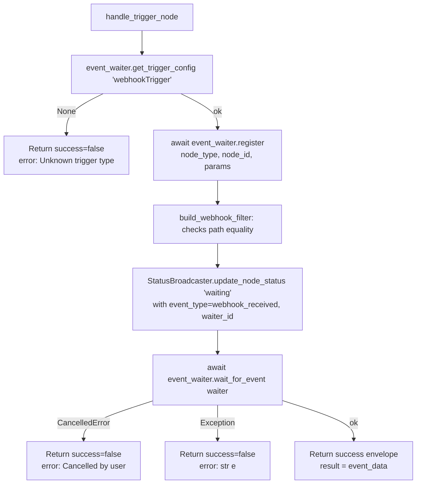

# Webhook Trigger (`webhookTrigger`)

| Field | Value |
|------|-------|
| **Category** | workflow / trigger |
| **Backend handler** | [`server/services/handlers/triggers.py::handle_trigger_node`](../../../server/services/handlers/triggers.py) (generic) |
| **Tests** | [`server/tests/nodes/test_workflow_triggers.py`](../../../server/tests/nodes/test_workflow_triggers.py) |
| **Skill (if any)** | none |
| **Dual-purpose tool** | no |

## Purpose

Start a workflow when an HTTP request hits `/webhook/{path}`. The
`webhook` router in `server/routers/webhook.py` receives the request and
dispatches a `webhook_received` event via
`event_waiter.dispatch()`. This node registers an asyncio.Future waiter
(memory mode) or a Redis-Streams consumer group (Redis mode) via the shared
`event_waiter` module and blocks until a matching event is delivered.

## Inputs (handles)

| Handle | Connection type | Required | Purpose |
|--------|-----------------|----------|---------|
| (none) | - | - | Trigger nodes have no inputs. |

## Parameters

| Name | Type | Default | Required | displayOptions.show | Description |
|------|------|---------|----------|---------------------|-------------|
| `path` | string | `""` | yes | - | URL path segment - full URL is `http://host:3010/webhook/{path}`. Must match the incoming request's `path` for the filter to accept it. |
| `method` | options | `POST` | no | - | Filter for HTTP method at the router layer (not the handler's filter). Values: `GET` / `POST` / `PUT` / `DELETE` / `ALL`. |
| `responseMode` | options | `immediate` | no | - | `immediate` returns 200 OK right away; `responseNode` waits for a downstream `webhookResponse` node (see [`webhookResponse`](./webhookResponse.md)). |
| `authentication` | options | `none` | no | - | `none` or `header`. |
| `headerName` | string | `X-API-Key` | no | authentication == `header` | Expected header name. |
| `headerValue` | string | `""` | no | authentication == `header` | Expected header value. |

## Outputs (handles)

| Handle | Shape | Description |
|--------|-------|-------------|
| `output-main` | object | The webhook event dict built by the router - see below. |

### Output payload

Exact fields depend on the dispatch site in `routers/webhook.py`, typically:

```ts
{
  method: string;
  path: string;
  headers: Record<string, string>;
  query: Record<string, string>;
  body: string;
  json?: unknown;
}
```

Wrapped in the standard envelope.

## Logic Flow



## Decision Logic

- **Filter match** (`build_webhook_filter` in `triggers.py`): accepts any
  event whose `data.path` equals `params.path`. If `path` is empty the
  filter accepts anything.
- **Method / authentication** are NOT enforced inside the filter - they are
  supposed to be enforced at the router layer when the HTTP request lands.
  The handler/filter only looks at `path`.
- **Cancellation**: user-initiated cancel via `cancel_event_wait` produces
  `success=False, error="Cancelled by user"`.

## Side Effects

- **Database writes**: none inside the handler. (Redis mode writes waiter
  metadata to a Redis key `waiters:<uuid>` with a 24h TTL via `CacheService`.)
- **Broadcasts**: `update_node_status(node_id, "waiting", {message, event_type, waiter_id}, workflow_id)`
  exactly once when the waiter is registered.
- **External API calls**: none.
- **File I/O**: none.
- **Subprocess**: none.

## External Dependencies

- **Credentials**: none.
- **Services**: `services.event_waiter`, `services.status_broadcaster`,
  `routers.webhook` (dispatches events via `broadcaster.send_custom_event` /
  `event_waiter.dispatch`).
- **Python packages**: stdlib only.
- **Environment variables**: none.

## Edge cases & known limits

- The handler registers a waiter with `timeout=None`, so it waits forever
  until either an event arrives or the run is cancelled. There is no
  handler-side timeout.
- When multiple `webhookTrigger` nodes share the same `path` (different
  workflows), they all receive the event. There is no deduplication in the
  filter.
- `method` and `authentication` parameters are not re-checked inside the
  filter; if the HTTP router's enforcement is bypassed (direct dispatch for
  testing) the trigger will fire regardless.
- Any unexpected exception inside `wait_for_event` is caught and converted
  into a `success=False` envelope - no stack trace leaks to the caller.

## Related

- **Skills using this as a tool**: none.
- **Companion node**: [`webhookResponse`](./webhookResponse.md) for
  `responseMode=responseNode`.
- **Sibling triggers**: [`chatTrigger`](./chatTrigger.md), [`taskTrigger`](./taskTrigger.md).
- **Architecture docs**: [Event Waiter System](../../event_waiter_system.md)
