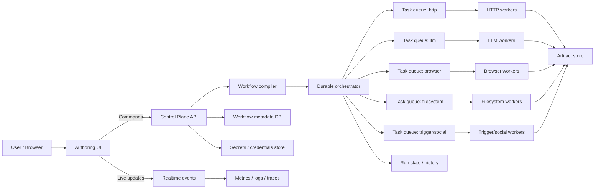

# Production-Scale Workflow Architecture Research

Last researched: 2026-04-12

## Goal

This document summarizes source-backed research for a production-scale MachinaOs architecture that can support:

- very large workflow graphs
- high runtime throughput
- low memory pressure
- durable and recoverable execution
- easy addition of new nodes
- easy addition of new configuration panels without disturbing existing nodes

This document is intentionally source-driven. Where it recommends a MachinaOs-specific design, that recommendation is an inference synthesized from the cited systems and the current codebase.

Related docs:

- [current_system_architecture_analysis.md](current_system_architecture_analysis.md)
- [config_driven_node_platform.md](config_driven_node_platform.md)

---

## Research Method

The source set for this document was restricted to official or primary documentation where possible:

- Temporal official docs
- Conductor official docs
- React Flow official docs
- n8n official docs
- JSON Schema official docs
- Backstage official docs
- Kubernetes official docs
- react-jsonschema-form official docs

Why this source set:

- Temporal and Conductor represent production workflow orchestration patterns
- React Flow represents the graph authoring surface currently used in MachinaOs
- n8n is a strong reference for node platform ergonomics
- JSON Schema and `uiSchema` cover config-driven validation and form generation
- Backstage provides a trustworthy extension-point model
- Kubernetes CRDs provide a strong versioned declarative API reference

---

## What Trusted Production Systems Actually Do

### 1. Durable orchestrators separate orchestration from execution

Temporal's core model is durable execution. Workflow logic is durable and resumable, while workers execute application code outside the Temporal server. This separation is important because it prevents the orchestrator from becoming the place where business logic, IO, and long-lived in-process state all pile up.

MachinaOs inference:

- the control plane should orchestrate workflow state
- specialized workers should execute node logic
- the control plane should not become the long-running execution host for every node type

Source:

- [Temporal Docs](https://docs.temporal.io/)

### 2. Large-scale workflow engines use worker-task queue architectures

Conductor's architecture documentation is explicit that workflows execute through worker-task queues, where each task type has its own queue and workers poll or receive work for the task types they know how to execute.

Conductor also documents the metrics that should drive scaling:

- queue depth
- worker throughput
- queue wait time

MachinaOs inference:

- worker pools should scale by capability and queue health, not by a single giant process
- node execution should be partitioned by execution class such as HTTP, browser, LLM, social, filesystem, and triggers

Sources:

- [Conductor Architecture Overview](https://conductor-oss.github.io/conductor/devguide/architecture/index.html)
- [Conductor Workers](https://conductor-oss.github.io/conductor/devguide/concepts/workers.html)
- [Conductor Scaling Workers](https://conductor-oss.github.io/conductor/devguide/how-tos/Workers/scaling-workers.html)

### 3. Large graph editors do not try to render everything equally

React Flow's own performance guidance highlights the main problems for large node graphs:

- unnecessary rerenders
- over-subscribing to the full nodes array
- expensive custom node components
- large visible trees

React Flow also provides an expand/collapse example that keeps the full graph model while rendering only the visible portion.

MachinaOs inference:

- large workflows need subflows, collapse, and visibility-aware rendering
- layout work and expensive graph transforms should move off the main thread
- node components should be cheap and memoized

Sources:

- [React Flow Performance](https://reactflow.dev/learn/advanced-use/performance)
- [React Flow Expand and Collapse](https://reactflow.dev/examples/layout/expand-collapse)
- [React Flow Auto Layout](https://reactflow.dev/examples/layout/auto-layout)

### 4. Productive node platforms are declarative first, programmatic second

n8n's node creation docs are unusually clear:

- use declarative nodes for most REST integrations
- use programmatic nodes for triggers, non-REST protocols, transformations, and advanced behavior
- version nodes so existing workflows keep using the version they were built with

MachinaOs inference:

- most node additions should be declarative manifests
- only a smaller subset should require custom runtime code
- node versioning must be first-class before the catalog gets large

Sources:

- [Choose your node building approach](https://docs.n8n.io/integrations/creating-nodes/plan/choose-node-method/)
- [Node base file](https://docs.n8n.io/integrations/creating-nodes/build/reference/node-base-files/)
- [Node versioning](https://docs.n8n.io/integrations/creating-nodes/build/reference/node-versioning/)

### 5. Config-driven platforms need separate validation and UI contracts

JSON Schema is well suited for declaring data structure, validation, defaults, and composition. It also supports explicit dialect declaration using `$schema`, which matters when a platform wants long-term compatibility.

`uiSchema` exists because data validation and UI rendering are different concerns. JSON Schema says what is valid; `uiSchema` says how to render and organize it.

MachinaOs inference:

- node parameter contracts should use JSON Schema
- panel layout and rendering hints should use a separate UI-oriented schema
- the platform should version both

Sources:

- [JSON Schema Reference](https://json-schema.org/understanding-json-schema)
- [JSON Schema Dialect and Vocabulary Declaration](https://json-schema.org/understanding-json-schema/reference/schema)
- [react-jsonschema-form uiSchema](https://rjsf-team.github.io/react-jsonschema-form/docs/api-reference/uiSchema/)

### 6. Stable modular systems prefer narrow extension points

Backstage's backend system emphasizes extension points with small interfaces rather than one large global plugin API. It also recommends exposing multiple focused extension points instead of a single large surface.

MachinaOs inference:

- node extensibility should expose several narrow interfaces
- different platform concerns should not be bundled into one registry

Sources:

- [Backstage Extension Points](https://backstage.io/docs/backend-system/architecture/extension-points/)
- [Backstage Backend Architecture](https://backstage.io/docs/backend-system/architecture/index/)
- [Backstage Modules](https://backstage.io/docs/next/backend-system/architecture/modules)

### 7. Versioned declarative APIs work best with structural schemas

Kubernetes CRDs are a strong precedent for:

- versioned resource definitions
- structural schemas
- explicit spec and status separation
- independent controllers that reconcile declared state

MachinaOs inference:

- node manifests should be versioned resources, not ad hoc JSON blobs
- workflow specs should be validated structurally
- runtime status should be kept separate from node spec

Sources:

- [Kubernetes Custom Resources](https://kubernetes.io/docs/concepts/api-extension/custom-resources/)
- [Extend the Kubernetes API with CRDs](https://kubernetes.io/docs/tasks/access-kubernetes-api/extend-api-custom-resource-definitions/)
- [CRD Versioning](https://kubernetes.io/docs/tasks/extend-kubernetes/custom-resources/custom-resource-definition-versioning)

---

## The Three Different "1000+ Node" Problems

The phrase "1000+ nodes" actually describes three different scale problems. They should not be solved with one technique.

### Problem A: 1000+ nodes in one authoring graph

This is a frontend/editor problem.

Main design response:

- subflows
- collapse and expand
- viewport-aware rendering
- lightweight node chrome
- background layout workers

### Problem B: 1000+ runtime steps in a workflow execution

This is an orchestration and execution problem.

Main design response:

- compile workflow JSON into an execution IR
- partition work into executable stages
- dispatch work to specialized worker pools
- persist metadata and artifact references, not large inline payloads

### Problem C: 1000+ node types in the product catalog

This is a platform and extensibility problem.

Main design response:

- versioned canonical `NodeSpec`
- declarative nodes for most integrations
- small programmatic runtime interface for advanced nodes
- generated panels and docs from spec metadata

If those three problem classes are blurred together, the resulting architecture tends to become overcomplicated and underperforming.

---

## Recommended Target Architecture For MachinaOs

This section is the MachinaOs-specific recommendation inferred from the sources above and from the current repository structure.

### High-level planes

MachinaOs should be split conceptually into five planes:

1. Authoring plane
2. Control plane
3. Execution plane
4. Artifact plane
5. Observability plane

### Plane responsibilities

#### Authoring plane

Owns:

- React Flow editor
- palette
- inspector panels
- docs/help surfaces
- validation display
- execution view and trace navigation

Does not own:

- orchestration
- business execution
- secret storage

#### Control plane

Owns:

- workflow validation
- workflow compilation
- deployment records
- run lifecycle
- scheduling
- authn/authz
- audit and policy

Recommended technologies and boundaries:

- HTTP or gRPC command surface
- WebSocket or SSE for subscriptions
- durable workflow orchestrator

#### Execution plane

Owns:

- task execution
- IO
- provider-specific adapters
- retries at the worker boundary
- side effects

Recommended shape:

- stateless workers
- workers partitioned by capability

#### Artifact plane

Owns:

- large outputs
- attachments
- traces
- generated files
- intermediate data snapshots when needed

Recommended rule:

- large outputs should be stored by reference, not pushed inline through the whole stack

#### Observability plane

Owns:

- metrics
- logs
- traces
- run timeline
- queue health
- worker health

Recommended rule:

- the app should be able to answer why a run is slow, stuck, retried, or memory-heavy without reading raw process logs

---

## Target Topology Diagram

---

## Performance Strategy For High Runtime And Low Memory

### 1. Compile workflows before executing them

Do not execute raw editor JSON directly if the goal is production-scale efficiency.

Compile the workflow graph into an execution IR that resolves:

- validated node versions
- port compatibility
- parameter defaults
- subflow boundaries
- retry policy inheritance
- worker capability bindings

Benefits:

- less work during execution
- better caching keys
- more stable observability
- more predictable failure surfaces

### 2. Partition worker pools by capability

Do not put all node execution into one generic worker pool.

Suggested capability pools:

- `http`
- `llm`
- `browser`
- `filesystem`
- `social`
- `trigger`
- `code`
- `document`

Benefits:

- better autoscaling
- better isolation
- lower memory fragmentation
- fewer dependency conflicts

### 3. Treat large outputs as artifacts

Large outputs should not stay inline across:

- worker memory
- orchestrator payloads
- websocket broadcasts
- frontend node state

Preferred pattern:

- keep a small metadata envelope in run state
- store large content in filesystem or object storage
- pass references and previews downstream when possible

### 4. Use queue metrics to scale

Conductor's metrics guidance maps well to MachinaOs. The minimum useful autoscaling signals are:

- queue depth
- queue wait time
- task completion rate
- worker saturation

This is a more trustworthy scaling method than using CPU alone.

### 5. Prefer durable orchestration over homegrown long-running state machines

MachinaOs already includes Temporal integration. The most conservative production recommendation is:

- keep Temporal as the durable orchestration backbone
- avoid inventing a third orchestration model in parallel

This is especially important for:

- retries
- backoff
- long-running agents
- waiting states
- human-in-the-loop interactions
- resumability

---

## Editor Strategy For Large Graphs

### Required design moves

1. Subflows as first-class nodes
2. Collapse and expand at group and subflow boundaries
3. Viewport-aware rendering
4. Memoized node and edge components
5. Avoid broad subscriptions to full graph arrays
6. Move layout work off the main thread

### Recommended editor model

- store the complete graph model
- render only visible nodes and edges
- keep collapsed regions summarized
- calculate layout in a worker or background thread

This follows the shape React Flow's guidance pushes toward.

### UX consequence

Users should not need to visually manipulate a 1000-node flat canvas. The system should encourage structure:

- groups
- folders
- packages
- subflows
- reusable templates

That is a system design decision, not just a UI optimization.

---

## Node Platform Strategy

### Canonical object: `NodeSpec`

The platform should use a versioned, manifest-first `NodeSpec` as the canonical source of truth for most nodes.

The `NodeSpec` should capture:

- identity
- version
- category
- ports
- parameters schema
- UI schema
- credentials needs
- docs/help metadata
- runtime binding
- retry and timeout defaults
- compatibility and feature flags

### Node classes

MachinaOs should explicitly separate two node classes:

#### Declarative nodes

Use for:

- REST-style integrations
- parameterized utility nodes
- many CRUD-style SaaS integrations
- nodes whose behavior can be expressed through templates, mappings, and standard runners

Expected share:

- most of the catalog

#### Programmatic nodes

Use for:

- triggers
- browser automation
- code execution
- streaming or long-lived IO
- complex transforms
- highly specialized runtimes

Expected share:

- minority of the catalog

This mirrors n8n's advice and aligns with how production node platforms avoid code sprawl.

---

## Panel Strategy

To make new node addition easy, panel generation must become spec-driven too.

The following UI surfaces should be generated primarily from spec metadata:

- palette entries
- inspector form
- credentials picker
- input and output docs
- validation panel
- inline help
- node docs panel
- examples panel

This is the practical meaning of "all other panels should also be easy to configure".

Without that, the platform still has hidden coupling even if execution becomes config-driven.

---

## Modularity Model

Backstage's extension-point guidance is a strong pattern to follow here. MachinaOs should expose narrow extension points instead of one central mutable registry.

Recommended extension points:

- `NodeSpecProvider`
- `RuntimeProvider`
- `CredentialProvider`
- `InspectorRendererProvider`
- `OutputRendererProvider`
- `ValidationRuleProvider`
- `DocsProvider`

Each should stay small. Adding a new node should usually install data into existing extension points, not require touching a large central switchboard.

---

## Proposed Production Choice For MachinaOs

If the goal is to choose one production direction instead of inventing another orchestration model, the cleanest combination is:

- Temporal for durable orchestration and waiting states
- queue-specialized workers for node execution
- JSON Schema plus `uiSchema` for node configuration contracts
- React Flow only as the authoring and graph visualization layer
- Backstage-style extension points for modularity
- CRD-like versioned `NodeSpec` resources for compatibility

This combination is source-aligned and fits the current repo better than a full rewrite.

---

## Tradeoffs

### What this architecture improves

- resilience
- worker isolation
- scaling clarity
- node onboarding ergonomics
- compatibility and versioning
- observability

### What it costs

- more explicit platform boundaries
- a compilation step
- more infrastructure than a single process
- a real contract for node specs and versioning
- migration work from the current code-first node model

These are good costs if the goal is a trustworthy production system instead of a fast-growing monolith.

---

## Recommended Next Steps For This Repo

1. Make one versioned `NodeSpec` the canonical source of truth for node metadata.
2. Reduce the WebSocket surface so it is primarily for subscriptions, not universal write traffic.
3. Split `Dashboard.tsx` and `WebSocketContext.tsx` into smaller bounded modules.
4. Introduce subflows and collapse as first-class editor concepts.
5. Create explicit worker capability pools and corresponding queue names.
6. Move large outputs to an artifact-first model.
7. Pin workflow runs to node versions and preserve backward compatibility for saved workflows.

---

## Source Bibliography

All links below are the primary sources used for this document.

- [Temporal Docs](https://docs.temporal.io/)
- [Conductor Architecture Overview](https://conductor-oss.github.io/conductor/devguide/architecture/index.html)
- [Conductor Workers](https://conductor-oss.github.io/conductor/devguide/concepts/workers.html)
- [Conductor Scaling Workers](https://conductor-oss.github.io/conductor/devguide/how-tos/Workers/scaling-workers.html)
- [React Flow Performance](https://reactflow.dev/learn/advanced-use/performance)
- [React Flow Expand and Collapse](https://reactflow.dev/examples/layout/expand-collapse)
- [React Flow Auto Layout](https://reactflow.dev/examples/layout/auto-layout)
- [n8n Choose Node Building Approach](https://docs.n8n.io/integrations/creating-nodes/plan/choose-node-method/)
- [n8n Node Base File Reference](https://docs.n8n.io/integrations/creating-nodes/build/reference/node-base-files/)
- [n8n Node Versioning](https://docs.n8n.io/integrations/creating-nodes/build/reference/node-versioning/)
- [JSON Schema Reference](https://json-schema.org/understanding-json-schema)
- [JSON Schema Dialect and Vocabulary Declaration](https://json-schema.org/understanding-json-schema/reference/schema)
- [Backstage Backend Architecture](https://backstage.io/docs/backend-system/architecture/index/)
- [Backstage Extension Points](https://backstage.io/docs/backend-system/architecture/extension-points/)
- [Backstage Modules](https://backstage.io/docs/next/backend-system/architecture/modules)
- [Kubernetes Custom Resources](https://kubernetes.io/docs/concepts/api-extension/custom-resources/)
- [Kubernetes CRD Structural Schema Guide](https://kubernetes.io/docs/tasks/access-kubernetes-api/extend-api-custom-resource-definitions/)
- [Kubernetes CRD Versioning](https://kubernetes.io/docs/tasks/extend-kubernetes/custom-resources/custom-resource-definition-versioning)
- [react-jsonschema-form uiSchema](https://rjsf-team.github.io/react-jsonschema-form/docs/api-reference/uiSchema/)
